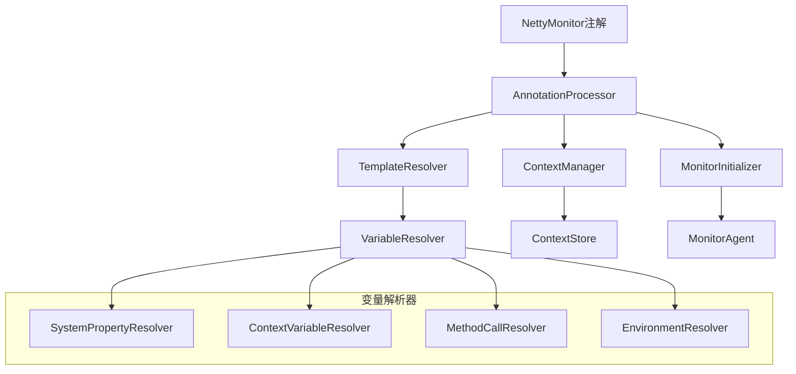
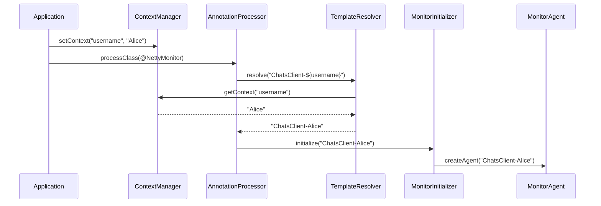

# 动态Netty监控注解系统设计文档

## 概述

agent模块的设计目标为一个轻量级、零依赖（除netty-all外）的监控代理库，支持通过@NettyMonitor注解自动启动监控功能。

在此基础上，本设计文档中描述了agent模块的注解驱动架构， 以及如何实现一个支持动态应用名称的@NettyMonitor注解系统。
该系统通过模板变量、上下文注入和智能处理器，在保持注解简洁性的同时提供动态配置能力。


核心设计理念：
- **简单易用**：通过注解即可启用监控，无需复杂配置
- **零依赖**：只依赖netty-all，避免依赖冲突
- **自动化**：自动连接管理、重连机制、包扫描
- **轻量级**：内置简单的JSON和日志工具，最小化资源占用


## 架构设计 Architecture


### 整体架构

```
┌─────────────────────────────────────────────────────────────┐
│                    User Application                         │
├─────────────────────────────────────────────────────────────┤
│  @NettyMonitor Annotation  │  Manual API  │  Auto Scanning │
├─────────────────────────────────────────────────────────────┤
│              MonitorAnnotationProcessor                     │
├─────────────────────────────────────────────────────────────┤
│                    MonitorAgent                             │
│  ┌─────────────────┐  ┌─────────────────┐  ┌─────────────┐ │
│  │  Connection     │  │   Data          │  │   Lifecycle │ │
│  │  Management     │  │   Collection    │  │   Management│ │
│  └─────────────────┘  └─────────────────┘  └─────────────┘ │
├─────────────────────────────────────────────────────────────┤
│                    Utility Layer                           │
│  ┌─────────────────┐  ┌─────────────────┐  ┌─────────────┐ │
│  │    JsonUtil     │  │     Logger      │  │   Others    │ │
│  └─────────────────┘  └─────────────────┘  └─────────────┘ │
├─────────────────────────────────────────────────────────────┤
│                      Netty Core                            │
└─────────────────────────────────────────────────────────────┘
```

### 模块结构

```
agent/
├── src/main/java/com/yueny/stars/netty/monitor/agent/
│   ├── annotation/
│   │   └── NettyMonitor.java                    # 监控注解定义
│   ├── core/
│   │   ├── MonitorAgent.java                    # 监控代理核心类
│   │   ├── MonitorHandler.java                  # 监控数据收集Handler
│   │   └── MonitorBootstrap.java                # 启动引导类（新增）
│   ├── processor/
│   │   ├── MonitorAnnotationProcessor.java      # 注解处理器
│   │   └── PackageScanner.java                  # 包扫描器（新增）
│   ├── model/
│   │   ├── ChannelInfo.java                     # Channel信息模型
│   │   └── MonitorMessage.java                  # 监控消息模型
│   ├── util/
│   │   ├── JsonUtil.java                        # JSON工具类
│   │   ├── Logger.java                          # 日志工具类
│   │   └── ReflectionUtil.java                  # 反射工具类（新增）
│   └── NettyMonitorAgent.java                   # 主入口类（重构）
└── pom.xml
```


### 核心组件架构



### 数据流设计



## 组件设计

### 1. NettyMonitor注解

```java
@Target({ElementType.TYPE, ElementType.METHOD})
@Retention(RetentionPolicy.RUNTIME)
public @interface NettyMonitor {
    /**
     * 应用名称模板，支持变量替换
     * 例如: "ChatsClient-${username}", "Server-${server.port}"
     */
    String applicationName() default "${class.simpleName}";
    
    /**
     * 监控服务器地址模板
     */
    String host() default "${monitor.host:localhost}";
    
    /**
     * 监控服务器端口
     */
    int port() default 19999;
    
    /**
     * 是否启用延迟初始化
     */
    boolean lazyInit() default true;
    
    /**
     * 初始化超时时间（毫秒）
     */
    int initTimeout() default 5000;
    
    /**
     * 是否启用监控
     */
    boolean enabled() default true;
}
```

### 2. 上下文管理器

```java
public class MonitorContextManager {
    private static final ThreadLocal<Map<String, Object>> THREAD_CONTEXT = new ThreadLocal<>();
    private static final Map<String, Object> GLOBAL_CONTEXT = new ConcurrentHashMap<>();
    
    /**
     * 设置全局上下文变量
     */
    public static void setGlobalContext(String key, Object value);
    
    /**
     * 设置线程本地上下文变量
     */
    public static void setThreadContext(String key, Object value);
    
    /**
     * 获取上下文变量（优先级：线程本地 > 全局 > 系统属性）
     */
    public static Object getContext(String key);
    
    /**
     * 批量设置上下文
     */
    public static void setContexts(Map<String, Object> contexts);
}
```

### 3. 模板解析器

```java
public class TemplateResolver {
    private final List<VariableResolver> resolvers;
    
    /**
     * 解析模板字符串
     * 支持格式：${variable}, ${variable:defaultValue}, ${method()}
     */
    public String resolve(String template, Object instance);
    
    /**
     * 验证模板语法
     */
    public ValidationResult validate(String template);
}

// 变量解析器接口
public interface VariableResolver {
    boolean canResolve(String variable);
    Object resolve(String variable, Object instance);
    int getPriority(); // 解析器优先级
}
```

### 4. 智能注解处理器

```java
public class SmartMonitorAnnotationProcessor {
    private final TemplateResolver templateResolver;
    private final MonitorContextManager contextManager;
    private final Map<String, PendingInitialization> pendingInits;
    
    /**
     * 处理类级别注解
     */
    public void processClass(Class<?> clazz);
    
    /**
     * 延迟初始化处理
     */
    public void processLazyInitialization(Class<?> clazz, NettyMonitor annotation);
    
    /**
     * 重试失败的初始化
     */
    public void retryFailedInitializations();
}
```

### 5. 内置变量解析器

#### SystemPropertyResolver
```java
public class SystemPropertyResolver implements VariableResolver {
    // 解析 ${system.property} 和 ${system.property:default}
    public Object resolve(String variable, Object instance) {
        String[] parts = variable.split(":");
        String property = parts[0];
        String defaultValue = parts.length > 1 ? parts[1] : null;
        return System.getProperty(property, defaultValue);
    }
}
```

#### ContextVariableResolver
```java
public class ContextVariableResolver implements VariableResolver {
    // 解析 ${contextKey} 和 ${contextKey:default}
    public Object resolve(String variable, Object instance) {
        return MonitorContextManager.getContext(variable);
    }
}
```

#### MethodCallResolver
```java
public class MethodCallResolver implements VariableResolver {
    // 解析 ${methodName()} 和 ${field.methodName()}
    public Object resolve(String variable, Object instance) {
        // 使用反射调用方法
    }
}
```

## 使用模式设计

### 模式1：简单上下文注入

```java
// 应用启动时设置上下文
MonitorContextManager.setGlobalContext("username", clientName);
MonitorContextManager.setGlobalContext("server.port", serverPort);

@NettyMonitor(applicationName = "ChatsClient-${username}")
public class ChatsClient {
    // 自动初始化为 "ChatsClient-Alice"
}
```

### 模式2：方法调用模式

```java
@NettyMonitor(applicationName = "ChatsClient-${getClientName()}")
public class ChatsClient {
    public String getClientName() {
        return this.clientName;
    }
}
```

### 模式3：系统属性模式

```java
@NettyMonitor(
    applicationName = "Server-${server.port:8080}",
    host = "${monitor.host:localhost}"
)
public class ChatsServer {
    // 从系统属性读取，有默认值
}
```

### 模式4：复合模式

```java
@NettyMonitor(
    applicationName = "${app.name:ChatApp}-${instance.id}-${server.port}",
    lazyInit = true,
    initTimeout = 10000
)
public class ComplexApplication {
    // 支持多个变量组合
}
```

## 错误处理策略

### 1. 模板解析错误
- 语法错误：提供详细的错误位置和修复建议
- 变量未找到：记录警告并使用默认值或变量名
- 循环引用：检测并抛出异常

### 2. 初始化错误
- 延迟重试：对于lazyInit=true的情况，定期重试
- 降级处理：初始化失败时使用NoOp监控器
- 错误上报：记录详细的错误信息和堆栈

### 3. 上下文错误
- 类型不匹配：自动类型转换或使用toString()
- 空值处理：提供合理的默认行为
- 并发安全：确保上下文操作的线程安全

## 性能优化设计

### 1. 模板缓存
- 解析结果缓存：避免重复解析相同模板
- 变量监听：只在变量变化时重新解析
- 弱引用缓存：避免内存泄漏

### 2. 延迟初始化
- 按需初始化：只在真正需要时才初始化监控
- 批量处理：合并多个初始化请求
- 异步处理：避免阻塞主线程

### 3. 资源管理
- 自动清理：应用关闭时自动清理资源
- 引用计数：避免重复创建相同的监控实例
- 内存监控：监控内存使用情况

## 测试策略

### 1. 单元测试
- 模板解析测试：各种模板语法的正确性
- 变量解析器测试：每个解析器的功能
- 上下文管理测试：并发安全性和正确性

### 2. 集成测试
- 端到端测试：完整的注解处理流程
- 错误场景测试：各种异常情况的处理
- 性能测试：大量注解处理的性能

### 3. 兼容性测试
- 向后兼容：确保现有代码正常工作
- 版本兼容：不同JDK版本的兼容性
- 框架集成：与Spring等框架的集成测试

## 部署和配置

### 1. 配置文件支持
```properties
# netty-monitor.properties
monitor.template.cache.enabled=true
monitor.lazy.init.enabled=true
monitor.error.retry.max=3
monitor.context.cleanup.interval=300000
```

### 2. Spring集成
```java
@Configuration
@EnableNettyMonitor
public class MonitorConfig {
    
    @Bean
    public MonitorContextInitializer contextInitializer() {
        return new MonitorContextInitializer();
    }
}
```

### 3. 调试支持
```java
// 启用调试模式
MonitorContextManager.setGlobalContext("monitor.debug", true);

// 查看当前上下文
MonitorContextManager.dumpContext();

// 验证模板
TemplateResolver.validate("${username}-${server.port}");
```