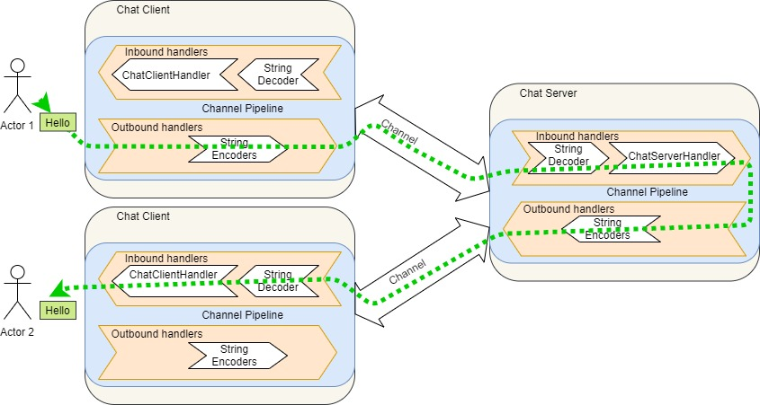

# Chat Server-Client application using Netty

1. Create console input based chat client application. 
2. On start of client, we will ask his name & afterwards get a chat message to send to other clients. 
3. Send name & chat message to chat server. 
4. Chat Server will then publish that message to all clients along with the name of the sender.

Here is the diagram which shows components of server & client. Below diagram also traces the communication path of a chat message “Hello” from one client to another.

## Enhanced
目前将聊天消息发送给所有客户端。可以让用户选择想要与之聊天的特定用户，并仅将消息发送给该用户。 实现文档：[聊天系统增强版](./README_Enhanced.md)

## Further improvements
1. 目前仅使用 String 编码器和解码器来交换字符串消息。您可以尝试自己编写编码器和解码器，来发送其他类型的对象或数据，比如文件、图片等。