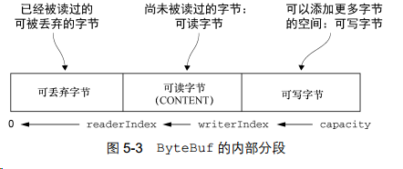
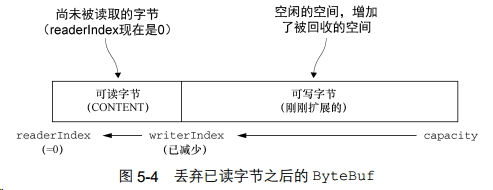
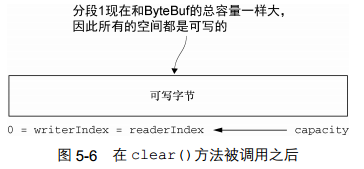

# netty-buffer

Netty 提供了 ByteBuf 作为它的字节容器，既解决了 JDK API 的局限性，又为网络应用程序提供了更好的 API，ByteBuf 的优点：
* 可以被用户自定义的缓冲区类型扩展
* 通过内置的复合缓冲区类型实现了透明的零拷贝
* 容量可以按需增长
* 在读和写这两种模式之间切换不需要调用 ByteBuffer 的 flip()方法
* 读和写使用了不同的索引
* 支持方法的链式调用
* 支持引用计数
* 支持池化

## 原理

ByteBuf通过两个索引（readerIndex、writerIndex）划分为三个区域：


任何名称以 `read` 或者 `skip` 开头的操作都将检索或者跳过位于当前 `readerIndex` 的数据，并且将它增加已读字节数；
任何名称以 `write` 开头的操作都将从当前的 `writerIndex` 处开始写数据，并将它增加已经写入的字节数。
`readerIndex` 不能超过 `writerIndex`。

如果被调用的方法需要一个 ByteBuf 参数作为读取的目标，并且没有指定目标索引参数，那么该目标缓冲区的 writerIndex 也将被增加；如果写操作的目标也是 ByteBuf，并且没有指定源索引的值，则源缓冲区的 readerIndex 也同样会被增加相同的大小。

如果尝试在缓冲区的可读字节数已经耗尽时从中读取数据， 那么将会引发一个IndexOutOfBoundsException；
如果尝试往目标写入超过目标容量的数据，将`检查当前的写索引`以及`最大容量是否可以在扩容`后容纳该数据，可以的话就会分配并调整容量，否则将会引发一个IndexOutOfBoundException。

通过调用 `discardReadBytes()` 方法， 可以丢弃已读字节并回收空间。但不建议频繁的调用 `discardReadBytes()`，因为将可能导致内存复制：


通过调用 `clear()` 方法来将 `readerIndex` 和 `writerIndex` 都设置为 0。 注意，调用 `clear()` 比调用 `discardReadBytes()` 轻量得多， 因为它将只是`重置索引而不会复制任何的内存`。


## ByteBuf 分配
ByteBuf 是一个抽象类，在程序中直接 `new ByteBuf()` 是不可行的。

有两种方法可以得到 ByteBuf 实例，一种是 ByteBufAllocator （实现了`池化，有效的降低了分配和释放内存的开销`），另一种是 Unpooled （Netty 提供的工具类来创建`未池化的ByteBuf` 实例）。

### ByteBufAllocator NETTY内存分配器
Netty 提供了两种 ByteBufAllocator 的实现，PooledByteBufAllocator（默认使用）和 UnpooledByteBufAllocator。

* PooledByteBufAllocator 池化了ByteBuf的实例以提高性能并最大限度地减少内存碎片；
* UnpooledByteBufAllocator的实现不池化ByteBuf实例， 并且在每次它被调用时都会返回一个新的实例。

> 在 Netty 中通过 AbstractChannelHandlerContext(也就是接口 ChannelHandlerContext) 和 NioSocketChannel 获取 ByteBufAllocator 的区别主要体现在上下文关联性和线程安全性上。
> 虽然两者最终可能返回相同的分配器实例，但在使用场景和最佳实践上有重要差异。

在工程中，一般还是建议在 ChannelHandler 中始终使用 ctx.alloc() 来进行 ByteBuf 分配。
原因：
* 自动关联当前 Channel 的配置
  + 本质是 ctx.channel().config().getAllocator() 的快捷方式，返回当前 Channel 绑定的分配器。
* 线程安全保证
  + 通过 ctx.alloc() 获取的分配器 保证在当前 ChannelHandler 的执行线程中安全使用（通常是该 Channel 注册的 EventLoop 线程）
* 支持动态配置覆盖
  + 如果 Pipeline 中有自定义的 ChannelOption 修改了分配器（如使用 ctx.channel().config().setAllocator()），此方式能立即获取最新值。


## 实例化ByteBuf的方式
1. 通过 Channel 实例化 ByteBuf
```
Channel channel = ...
ByteBuf buf = channel.alloc();
```

2. 通过 ChannelHandlerContext 实例化 ByteBuf
```
ChannelHandlerContext ctx = ...
ByteBuf buf = ctx.alloc();
```

3. 首先实例化 ByteBufAllocator， 再实例化 ByteBuf
* 实例化 ByteBufAllocator
  + `com.yueny.stars.netty.buffer.allocator.ByteBufAllocatorFactory`: ByteBufAllocator 实例化工厂
  + `com.yueny.stars.netty.buffer.allocator.ByteBufAllocatorFactoryTest`: 测试用例

```
# Default ByteBufAllocator
ByteBufAllocator alloc = ByteBufAllocator.DEFAULT;

ByteBufAllocator alloc = PooledByteBufAllocator.DEFAULT;

ByteBufAllocator alloc = UnpooledByteBufAllocator.DEFAULT;

Channel channel = new NioSocketChannel();
ByteBufAllocator alloc = channel.alloc();
```

* 再通过 ByteBufAllocator 实例化 ByteBuf
  + `com.yueny.stars.netty.buffer.buf.ByteBufExample`: ByteBuf 的实例化方式例子
  + `com.yueny.stars.netty.buffer.buf.ByteBufExampleTest`: 测试用例
  + `com.yueny.stars.netty.buffer.ByteBufPositionTest`: 关于 ByteBufPosition 的测试用例

```
ByteBufAllocator alloc = ...

ByteBuf buf = alloc.buffer();
ByteBuf buf = alloc.buffer(256, Integer.MAX_VALUE);
ByteBuf buf = alloc.heapBuffer(256);
ByteBuf buf = alloc.directBuffer();
ByteBuf byteBuf = alloc.ioBuffer();
CompositeByteBuf compositeByteBuf = alloc.compositeBuffer();
CompositeByteBuf compositeByteBuf = alloc.compositeHeapBuffer(16);
```

4. 工具类实例化 ByteBuf

```
ByteBuf buf = Unpooled.buffer();
ByteBuf byteBuf = Unpooled.directBuffer(256, Integer.MAX_VALUE);
ByteBuf byteBufWrapped = Unpooled.wrappedBuffer("Hello Netty".getBytes());
```

## 常用Buffer子类一览
```
ByteBuffer，存储字节数据到缓冲区；

ShortBuffer，存储字符串数据到缓冲区；

CharBuffer，存储字符数据到缓冲区；

IntBuffer，存储整数数据到缓冲区；

LongBuffer，存储长整型数据到缓冲区；

DoubleBuffer，存储小数到缓冲区；

FloatBuffer，存储小数到缓冲区。
```

Buffer类定义了所有的缓冲区都具有的四个属性来提供关于其所包含的数据元素的信息：
* capacity：容量，既可以容纳的最大数据量；在缓冲区创建时被设定并且不能改变
* limit: 表示缓冲区的当前终点，不能对缓冲区超过极限的位置进行读写操作，且极限是可以修改的
* position: 位置，下一个要被读或写的元素的索引，每次读写缓冲区数据时都会改变该值，为下次读写做准备 
* mark: 标记

### Buffer类相关方法一览
```
public abstract class Buffer {
    // JDK1.4时引入的api
    public final int capacity() // 返回此缓冲区
    public final int position()    // 返回此缓冲区的位置
    public final Buffer position(int newPosition)    // 设置此缓冲区的位置
    public final int limit()    // 返回此缓冲区的限制
    public final Buffer limit(int newLimit)    // 设置此缓冲区的限制
    public final Buffer mark()    // 在此缓冲区的位置设置标记
    public final Buffer reset()    // 将此缓冲区的位置重置为以前标记的位置
    public final Buffer clear()    // 清除此缓冲区，即将各个标记恢复到初始状态，但是数据并没有真正擦除
    public final Buffer flip()    // 反转此缓冲区
    public final Buffer rewind()    // 重绕此缓冲区
    public final int remaining()    // 返回当前位置和限制之间是否有元素
    public abstract boolean isReadOnly();    // 告知此缓冲区是否为只读缓冲区
    
    // JDK1.6时引入的api
    public abstract boolean hasArray();    // 告知此缓冲区是否具有可访问的底层实现数组
    public abstract Object array();    // 返回此缓冲区的底层实现数组
    public abstract int arrayOffset();    // 返回此缓冲区的底层实现数组中第一个缓冲区元素的偏移量
    public abstract boolean isDirect();    // 告知此缓冲区是否为直接缓冲区
}
```

### ByteBuffer 类的主要方法
```
public abstract class ByteBuffer {
    public static ByteBuffer allocateDirect(int capacity)    // 创建直接缓冲区
    public static ByteBuffer allocate(int capacity)    // 设置缓冲区的初始容量
    public static ByteBuffer wrap(byte[] array)    // 把一个数组放到缓冲区中使用
    // 构造初始化位置offset和上界length的缓冲区
    public static ByteBuffer wrap(byte[] array, int offset, int length)
    // 缓冲区存储相关API
    public abstract byte get();    // 从当前位置position上get，get之后，position会自动+1
    public abstract byte get(int index);    // 从绝对位置get
    public abstract ByteBuffer put(byte b);    // 从当前位置上put，put之后，position会自动+1
    public abstract ByteBuffer put(int index, byte b);    // 从绝对位置上put
}
```

## ByteBuf 的使用模式
### 堆缓冲区
最常用的 ByteBuf 模式是将数据存储在 JVM 的堆空间中。 这种模式被称为支撑数组（backing array）， 它能在没有使用池化的情况下提供快速的分配和释放。

### 直接缓冲区
将数据驻留在会被垃圾回收的堆之外，直接缓冲区对于网络数据传输是最理想的选择，不过，相对于基于堆的缓冲区，它们的分配和释放都较为昂贵。另外，如果你的数据包含在一个在堆上分配的缓冲区中， 那么事实上，在通过套接字发送它之前， JVM将会在内部把你的缓冲区复制到一个直接缓冲区中。经验表明，Bytebuf的最佳实践是在IO通信线程的读写缓冲区使用DirectByteBuf，后端业务使用HeapByteBuf。

### 复合缓冲区
为多个 ByteBuf 提供一个聚合视图。 在这里你可以根据需要添加或者删除 ByteBuf 实例。 
Netty 通过一个 ByteBuf 子类——CompositeByteBuf——实现了这个模式， 它提供了一个将多个缓冲区表示为单个合并缓冲区的虚拟表示。

使用 CompositeByteBuf 的复合缓冲区模式的一个使用例子。
源代码路径: `com.yueny.stars.netty.buffer.buf.CompositeBufferExample`

```
public static void compositeBuffer() {
        CompositeByteBuf messageBuf = Unpooled.compositeBuffer();
        ByteBuf headBuf = Unpooled.copiedBuffer("Hello,", CharsetUtil.UTF_8);
        ByteBuf bodyBuf = Unpooled.copiedBuffer("Netty!", CharsetUtil.UTF_8);
        //将 ByteBuf 实例追加到 CompositeByteBuf
        messageBuf.addComponents(headBuf, bodyBuf);
        Iterator<ByteBuf> it = messageBuf.iterator();
        //访问CompositeByteBuf数据
        while(it.hasNext()){
            ByteBuf buf = it.next();
            while (buf.isReadable()){
                System.out.print((char) buf.readByte());
            }
        }
        //使用数组访问数据
        if(!messageBuf.hasArray()){
            int len = messageBuf.readableBytes();
            byte[] arr = new byte[len];
            messageBuf.getBytes(0, arr);
            for (byte b : arr){
                System.out.print((char)b);
            }
        }
        //删除位于索引位置为 0（第一个组件）的 ByteBuf
        messageBuf.removeComponent(0);
    }
```

## ByteBuf 操作
### 数据遍历
```
for (int i = 0; i < byteBuf.capacity(); i++) {
    byte aByte = byteBuf.getByte(i);
    System.out.print((char) aByte);
}

while (byteBuf.isReadable()){
    System.out.print((char) byteBuf.readByte());
}
```

### 写入数据
```
while (byteBuf.writableBytes() >= 4){
    byteBuf.writeByte(65);
}
```

### 索引标记管理
```
ByteBuf buf = byteBuf.readerIndex(0);//将 readerIndex 移动到指定的位置
buf.markReaderIndex();//标记当前的 readerIndex
while (buf.isReadable()){
    System.out.print((char) buf.readByte());
}
buf.resetReaderIndex();//回退到之前标记的 readerIndex
while (buf.isReadable()){
    System.out.print((char) buf.readByte());
}

int index = byteBuf.indexOf(0, byteBuf.capacity() - 1, (byte) 65);//在某个范围内查找某个字节的索引
```

### 复制操作
```
ByteBuf copy = buf.copy(0, 15);
System.out.println(copy.toString(CharsetUtil.UTF_8));
copy.setByte(0, (byte) 'A');
System.out.println((char) byteBuf.getByte(0));
```

### 分片操作
ByteBuf 提供了专门的方式来实现复制分片操作：
* duplicate()
* slice()
* slice(int, int)
* Unpooled.unmodifiableBuffer(…)
* order(ByteOrder)
* readSlice(int)

这些方法都将返回一个新的 ByteBuf 实例，它具有自己的读索引、写索引和标记索引。其内部存储和 JDK 的 ByteBuffer 一样也是共享的。这意味着，如果你修改了它的内容，也同时修改了其对应ByteBuf的源实例。

因此，如果需要一个现有缓冲区的`真实副本`，请使用 copy()或者 copy(int, int)方法。

```
ByteBuf slice = byteBuf.slice(0, 15);
System.out.print(slice.toString(CharsetUtil.UTF_8));

//更新索引0处的字节
slice.setByte(0, (byte) 'J');
byte aByte = byteBuf.getByte(0);
System.out.print("\r\n" + (char)aByte);
```

### 其他操作
```
System.out.println("如果至少有一个字节可读取：" + byteBuf.isReadable());
System.out.println("如果至少有一个字节可写入：" + byteBuf.isWritable());
System.out.println("返回可被读取的字节数：" + byteBuf.readableBytes());
System.out.println("返回可被写入的字节数：" + byteBuf.writableBytes());
System.out.println("可容纳的字节数：" + byteBuf.capacity() + ",可扩展最大的字节数：" + byteBuf.maxCapacity());
System.out.println("是否由一个字节数组支撑：" + byteBuf.hasArray());
System.out.println("由一个字节数组支撑则返回该数组：" + byteBuf.array().length);
System.out.println("计算第一个字节的偏移量：" + byteBuf.arrayOffset());
System.out.println("返回Bytebuf的十六进制：" + ByteBufUtil.hexDump(byteBuf.array()));
```


> 最后，祝大家开心每一天 ~
