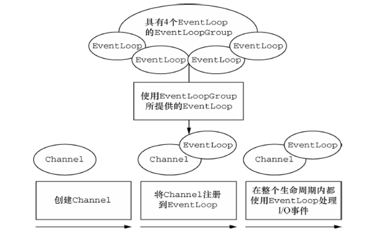

# netty-channel

在 Netty 框架中，Channel 是网络通信的核心载体，它代表了一个开放的连接，用于执行网络 I/O 操作。无论是客户端与服务器的连接，还是数据的读写操作，都离不开 Channel 的参与。

> 统一的 API：无论底层是 NIO、OIO（Old Blocking IO）还是本地传输，Netty 都通过 Channel 接口提供统一的操作视图，极大地简化了编程模型。

Channel 封装了底层的网络连接，提供了统一的 API 用于：
* 建立和关闭连接
* 读写数据
* 注册和注销事件
* 获取连接状态信息

Channel 具有以下重要特性：
* 双向性：既可读也可写
* 异步性：所有 I/O 操作都是异步的，通过 Future 和 Callback 处理结果
 + 异步和事件驱动：所有 I/O 操作都是异步的，会立即返回一个 ChannelFuture，你可以在其上添加监听器以在操作完成（成功、失败或取消）时接收通知。这是 Netty 高性能的基石。
* 层次性：通过 ChannelPipeline 组织 ChannelHandler 形成处理链
* 生命周期：包含一系列状态（open、connected、bound 等）及状态转换方法

## Channel 生命周期
Channel需要被注册到某个EventLoop上，在Channel整个生命周期内都由这个EventLoop处理IO事件，也就是说一个Channel和一个EventLoop进行了绑定， 但是一个EventLoop可以同时被多个Channel绑定。



> 基本的I/O操作（bind()、connect()、read()和 write()）依赖于底层网络传输所提供的原语。

`Channel` 的生命周期状态：
* `ChannelUnregistered` ：`Channel` 已经被创建，但还未注册到`EventLoop`
* `ChannelRegistered` ：`Channel` 已经被注册到了 `EventLoop`
* `ChannelActive` ：`Channel` 处于活动状态（已经连接到它的远程节点）。它现在可以接 收和发送数据了
* `ChannelInactive` ：`Channel` 没有连接到远程节点 当这些状态发生改变时，将会生成对应的事件。这些事件将会被转发给`ChannelPipeline` 中的`ChannelHandler`，其可以随后对它们做出响应。在我们的编程中，关注`ChannelActive` 和 `ChannelInactive` 会更多一些。


## Channel 核心 API 概览

### 状态检查
* isOpen()：判断 Channel 是否打开
* isActive()：判断 Channel 是否处于活动状态（已连接）。如果 Channel 是活动的，则返回true。活动的意义可能依赖于底层的传输。 例如，一个Socket 传输一旦连接到了远程节点便是活动的，而一个Datagram 传输一旦被打开便是活动的。
* isRegistered()：判断 Channel 是否已注册到 EventLoop
* isWritable()：判断 Channel 是否可以被写入

### I/O 操作：
* read()：读取数据到缓冲区
* write(Object msg)：将数据写入 Channel缓冲区。注意：这只是将数据放入出站缓冲区，并不保证立即刷新到网络。（不立即发送）
* flush： 将之前已写的数据冲刷到底层socket进行传输。
* writeAndFlush(Object msg)：将数据写入并立即刷新缓冲区。立即发送

### 连接管理：
* bind(SocketAddress localAddress)：绑定本地地址
* localAddress():  返回本地的SokcetAddress
* remoteAddress(): 返回远程的SocketAddress
* connect(SocketAddress remoteAddress)：连接远程地址
* close()：关闭 Channel
* closeFuture(): 返回一个在 Channel 关闭时会通知的 ChannelFuture。
* pipeline(): 返回 Channel 的 ChannelPipeline，也就是说每个 Channel 都有自己的 ChannelPipeline。
* eventLoop(): 返回分配给Channel 的EventLoop

### 属性与配置：
* config()：获取此 Channel 的配置对象（如 ChannelOption）。
* attr(AttributeKey<T> key)：获取或设置 Channel 属性

Netty中的 Channel.attr() 方法让我们可以在 Channel 上绑定和使用自定义属性。这些属性会在整个 Channel 的生命周期中保持，也就是说，可以在任何时候，任何地方，通过同样的 Channel.attr()方法访问获取到这些属性。

实际上，Attr 是一个接口，Channel 通过类似于 Map 的机制来维护它们。使用 AttributeKey 非常简单，首先我们需要创建一个 AttributeKey 对象，例如：
> private static final AttributeKey<Integer> LOGIN_COUNT = AttributeKey.valueOf("loginCount");

上面的代码创建了一个 AttributeKey 对象，它的键名是 "loginCount"，值的类型是 Integer。我们可以在 Channel 上使用 AttributeKey 存储或获取 Integer 类型的属性，例如：
```
Channel channel = ...; // 获取一个 Channel 对象
channel.attr(LOGIN_COUNT).set(1); // 存储一个 Integer 类型的属性
Integer loginCount = channel.attr(LOGIN_COUNT).get(); // 获取 Integer 类型的属性
```

### ChannelFuture
netty中所有的IO都是异步IO，也就是说所有的IO都是立即返回的，返回的时候，IO可能还没有结束，所以需要返回一个ChannelFuture，当IO有结果之后，会去通知ChannelFuture，这样就可以取出结果了。

ChannelFuture是java.util.concurrent.Future的子类，它除了可以拿到线程的执行结果之外，还对其进行了扩展，加入了当前任务状态判断、等待任务执行和添加Listener的功能。

```
@Override
public void channelRead(ChannelHandlerContext ctx, Object msg) {
   ChannelFuture future = ctx.channel().close();
   future.addListener(new ChannelFutureListener() {
       public void operationComplete(ChannelFuture future) {
           // 调用其他逻辑
       }
   });
}
```

## 常见 Channel 类型及应用场景
Netty 为不同的传输协议和 I/O 模型提供了多种 Channel 实现。

**I/O 模型选择**:
* 非阻塞 I/O (推荐)：选择以 "Nio" 开头的 Channel
* 阻塞 I/O (兼容性)：选择以 "Oio" 开头的 Channel

**应用场景**：
* 高性能服务器：NioServerSocketChannel
* 客户端通信：NioSocketChannel
* 进程内通信：LocalChannel
* 文件处理：FileChannel
* 单元测试：EmbeddedChannel
* 实时数据传输：NioDatagramChannel


### ServerSocketChannel
ServerSocketChannel 是一个接口，它定义了服务器端用于监听入站 TCP 连接的通道的行为。它的核心作用与 Java NIO 的 ServerSocketChannel 一致，但它是 Netty 统一异步 I/O API 的一部分，提供了更强大的生命周期管理和配置能力。

通常不会直接实现这个接口，而是使用 Netty 提供的实现，最常见的是 `NioServerSocketChannel` 和 `EpollServerSocketChannel`。
`NioServerSocketChannel` 是基于 NIO 的 TCP 服务器端 Channel，用于`监听客户端连接请求`，创建 NioSocketChannel 处理后续通信。

应用场景：所有基于 TCP 协议的服务器端应用，如 HTTP 服务器、WebSocket 服务器等。

比如要实现 `回环 TCP 的跨进程本机通信`的功能，在`com.whosly.stars.netty.channel.serversocket.loopback.TcpLoopbackServer` 中使用 `NioServerSocketChannel` 监听 `127.0.0.1:9000`，
在 `com.whosly.stars.netty.channel.serversocket.loopback.TcpLoopbackClient` 中 NioSocketChannel 连接 127.0.0.1:9000， 即可实现本机的跨进程通信。


### SocketChannel
在 Netty 中，SocketChannel 是一个非常重要的抽象，它代表了一个客户端到服务器的连接，用于执行实际的网络 I/O 操作。
SocketChannel 是基于 NIO 的 TCP 客户端 Channel，用于与服务器建立 TCP 连接并 `进行数据交互`。

**主要作用包括**
* 建立和管理连接：
  + 负责与远程服务器建立 TCP 连接，无论是基于 NIO 的 NioSocketChannel 还是基于 OIO 的 OioSocketChannel ，都实现了 SocketChannel 接口。通过配置不同的参数，如超时时间、连接选项等，来控制连接的建立过程。 
  + 管理连接的生命周期，包括连接的激活（channelActive 事件）、关闭（channelInactive 事件）等状态变化，应用程序可以通过监听这些事件来执行相应的业务逻辑，比如在连接激活时发送认证信息，在连接关闭时释放相关资源。
* 数据读写操作：
  + 提供了异步读写数据的方法，通过将数据写入 Channel ，Netty 会负责将数据发送到远程服务器；同样，当有数据从服务器端到达时，SocketChannel 会触发 channelRead 事件，应用程序可以在对应的 ChannelInboundHandler 中处理接收到的数据。 
  + 支持对不同类型数据的读写，例如字节数组、字符串、自定义对象等，这通过在 ChannelPipeline 中添加合适的编解码器（如 StringDecoder、ObjectEncoder 等）来实现。
* 与其他组件协作：
  + 与 ChannelPipeline 紧密协作，ChannelPipeline 包含了一系列的 ChannelHandler ，这些处理器可以对进出 SocketChannel 的数据进行拦截、处理和转换，比如进行数据的压缩解压缩、加密解密等操作。 
  + 配合 EventLoop 执行 I/O 操作，EventLoop 负责处理 SocketChannel 的 I/O 事件（如读、写、连接等事件），并在单线程模型下保证操作的有序性和高效性。

应用场景：所有基于 TCP 协议的客户端应用，如 HTTP 客户端、消息队列客户端等。

**示例代码**
在这里，除了，还额外实现了心跳机制哦~

> * `com.whosly.stars.netty.channel.socket.SocketTcpClient`
> * `com.whosly.stars.netty.channel.socket.TcpClientHandler`
> * `com.whosly.stars.netty.channel.socket.HeartbeatHandler`
> * `com.whosly.stars.netty.channel.socket.SocketTcpServer`
> * `com.whosly.stars.netty.channel.socket.TcpServerHandler`
> * `com.whosly.stars.netty.channel.socket.ServerHeartbeatHandler`

**执行效果**
SocketTcpClient
```
已连接到地址为 ''127.0.0.1:59775'，传输: '套接字'' 的目标虚拟机
已连接到服务器：localhost:8080
连接已建立，可以开始通信
请输入要发送的消息(输入'quit'退出): 收到服务器消息: 欢迎连接到服务器! 你是第1个连接
发送心跳包
收到服务器消息: HEARTBEAT_RESPONSE
111
已发送消息: 111
请输入要发送的消息(输入'quit'退出): 收到服务器消息: 服务器回复: 111
发送心跳包
收到服务器消息: HEARTBEAT_RESPONSE
发送心跳包
收到服务器消息: HEARTBEAT_RESPONSE
```

SocketTcpServer
```
已连接到地址为 ''127.0.0.1:59683'，传输: '套接字'' 的目标虚拟机
服务器已启动，监听端口: 8080
客户端连接成功: /127.0.0.1:59860
当前连接数: 1
收到客户端消息: HEARTBEAT from /127.0.0.1:59860
收到客户端消息: 111 from /127.0.0.1:59860
收到客户端消息: HEARTBEAT from /127.0.0.1:59860
已与地址为 ''127.0.0.1:59683'，传输: '套接字'' 的目标虚拟机断开连接
收到客户端消息: HEARTBEAT from /127.0.0.1:59860
```


### LocalServerChannel
用于 `同一台机器上的进程间通信（IPC）`，基于 `JVM 内部的管道机制`，不涉及网络协议栈。

应用场景：需要在同一进程的不同组件间进行高效通信的场景。

**示例代码** 
> * `com.whosly.stars.netty.channel.local.LocalMainWithSameJVM`
> * `com.whosly.stars.netty.channel.local.LocalServer`
> * `com.whosly.stars.netty.channel.local.LocalServerHandler`
> * `com.whosly.stars.netty.channel.local.LocalClient`
> * `com.whosly.stars.netty.channel.local.LocalClientHandler`
> 
> 注意： 因为 LocalChannel 只能在同一 JVM 内通信；直接运行 LocalServer、LocalClient 时，没有在同 JVM 里先启动并绑定 LocalServer("my-local-server")，因此本地地址 local:my-local-server 未被绑定，出现 connection refused。
> 需要在此处运行，用于模拟同一进程内先起 LocalServer 再起 LocalClient。

**`LocalServerChannel`与`ServerSocketChannel`的区别**

| 区别       | LocalServerChannel                                                                       | ServerSocketChannel                                                                                          |
|----------|------------------------------------------------------------------------------------------|--------------------------------------------------------------------------------------------------------------|
| 传输介质     | 同 JVM 内存通道（in-JVM IPC），不走网络栈                                                             | 基于 TCP 的网络通道，经过内核网络栈                                                                                         |
| 地址类型     | LocalAddress（字符串名称即可）                                                                    | InetSocketAddress（IP + 端口）                                                                                   |
| 可达范围     | 仅限同一 JVM（同一进程）                                                                           | 同机/跨机皆可                                                                                                      |
| 性能与拷贝    | 无网卡/协议栈开销，低延迟，等价“内存队列 + 事件循环”，更接近零拷贝                                                     | 经过 TCP/IP 栈，存在系统调用与拷贝                                                                                        |
| 可靠性/网络语义 | 无网络抖动/丢包/粘包等问题，语义由实现保证（有背压与可写性语义的仿真）                                                     | 遵循 TCP 语义，需考虑 MTU、Nagle、KeepAlive 等                                                                          |
| 安全与隔离    | 不暴露网络面，更安全但只限本进程                                                                         | 需考虑端口暴露、防火墙/ACL/SSL 等                                                                                        |
| 使用场景     | 同进程内模块解耦、内存总线型 RPC、单机压测/单元测试                                                             | 常规对外服务、微服务通信                                                                                                 |
| 配置与引导    | ServerBootstrap.channel(LocalServerChannel.class).localAddress(new LocalAddress("name")) | Socket：ServerBootstrap.channel(NioServerSocketChannel.class).localAddress(new InetSocketAddress(host, port)) |
| 事件循环与依赖  | 可用 LocalEventLoopGroup/DefaultEventLoopGroup（无 Selector/Socket）                          | NIO NioEventLoopGroup 或原生 EpollEventLoopGroup/KQueueEventLoopGroup                                           |
| 限制       | 不能跨进程/跨机器；无 SO_* 套接字选项；不能用 OS 级网络工具观测流量                                                  | 通用网络能力，但开销更高                                                                                                 |


### DomainSocketChannel
> Epoll	Linux 高性能服务器, 极致的性能、更少的 GC, 仅限 Linux 平台

在分布式系统和本地进程间通信（IPC）场景中，高效、安全的数据传输至关重要。Unix 域套接字（Domain Socket）作为一种操作系统原生的 IPC 机制，相比 TCP/IP 环回接口具有更低的延迟和更高的吞吐量。
Netty 通过DomainSocketChannel系列类对这一机制进行了封装，为 Java 开发者提供了便捷、`高效的本地进程 Unix 域套接字通信`解决方案。

**Unix 域套接字**
Unix 域套接字是一种允许同一主机上不同进程间进行通信的机制，它不依赖网络协议栈，直接通过内核进行数据传输，因此具有以下优势：
1. 高性能：避免了 TCP/IP 协议栈的开销，减少了数据复制次数 
2. 安全性：通过文件系统权限控制访问，无需暴露网络端口 
3. 可靠性：不存在网络传输中的丢包、乱序问题 
4. 高吞吐量：适合传输大量数据的场景

Netty 中的DomainSocketChannel是对 Unix 域套接字的抽象，其核心实现类包括：
* NioDomainSocketChannel：基于 NIO 的客户端通道
* NioDomainServerSocketChannel：基于 NIO 的服务器端通道
* DomainSocketAddress：表示 Unix 域套接字的地址（通常是文件系统路径）

与传统的网络 Socket 不同，DomainSocket 使用文件系统路径作为地址标识，通信双方通过相同的路径进行连接。

**应用场景**
* 微服务架构中的本地组件通信：同一主机上的服务注册中心与服务实例之间的通信
* 数据库客户端与服务器通信：如 MySQL 本地连接可使用域套接字
* 容器间通信：Docker 容器与宿主机或同一宿主机上的容器间通信
* 日志收集系统：应用程序与本地日志收集进程的高效数据传输
* 监控系统：监控代理与被监控进程之间的信息交换

**示例代码**
Unix Domain Socket 示例，区分 Linux(epoll) 与 macOS(kqueue) 两套代码:
* Linux/epoll (Only supported on Linux)
  + `com.whosly.stars.netty.channel.uds.epoll.UdsEpollServer`、`com.whosly.stars.netty.channel.uds.epoll.UdsEpollServerHandler`
  + `com.whosly.stars.netty.channel.uds.epoll.UdsEpollClient`、`com.whosly.stars.netty.channel.uds.epoll.UdsEpollClientHandler`
* macOS/kqueue (Only supported on OSX/BSD)
  + `com.whosly.stars.netty.channel.uds.kqueue.UdsKqueueServer`、`com.whosly.stars.netty.channel.uds.kqueue.UdsKqueueServerHandler`
  + `com.whosly.stars.netty.channel.uds.kqueue.UdsKqueueClient`、`com.whosly.stars.netty.channel.uds.kqueue.UdsKqueueClientHandler`


### FileChannel
用于文件 I/O 操作(文件的数据读写)的通道，支持文件的读写和映射操作。

**示例代码**
`com.whosly.stars.netty.channel.file.NettyFileOperationExample`

```
try (FileChannel inChannel = FileChannel.open(sourcePath, StandardOpenOption.READ)) {

			System.out.println("开始读取文件...");
			ByteBuffer buffer = ByteBuffer.allocate(1024);
			int bytesRead;
			long fileSize = inChannel.size();

			// 读取文件内容
			while ((bytesRead = inChannel.read(buffer)) > 0) {
				buffer.flip();
				byte[] data = new byte[bytesRead];
				buffer.get(data);
				System.out.println("读取到内容: " + new String(data));
				buffer.clear();
			}

			System.out.println("文件读取完成");
			return new ReadResult(fileSize, sourcePath);
		}
```


### EmbeddedChannel
用于单元测试的嵌入式通道，不需要实际的网络连接。

**示例代码**
`com.whosly.stars.netty.channel.embedded.EmbeddedChannelExample`

```
// 创建嵌入式通道，添加测试处理器
        EmbeddedChannel channel = new EmbeddedChannel(
                new StringDecoder(),
                new StringEncoder(),
                new TestHandler()
        );

        // 写入测试数据
        String testData = "Hello, EmbeddedChannel!";
        ByteBuf buf = Unpooled.buffer().writeBytes(testData.getBytes());
        channel.writeInbound(buf);

        // 读取处理结果
        String received = channel.readInbound();
        
        // here, testData equals received
```


### DatagramChannel
NioDatagramChannel 是 Netty 对 Java NIO DatagramChannel 的封装，用于 UDP（用户数据报协议）通信， 用于无连接的数据包传输(UDP的数据读写)。
与基于连接的 TCP 不同，UDP 是一种无连接的协议，它发送独立的数据包（称为数据报），不保证交付顺序或可靠性，但具有更低的延迟和开销。

**主要特点**
* 无连接通信：不需要建立持久的连接，每个数据包都是独立的 
* 支持广播和多播：可以向多个接收者同时发送数据 
* 低延迟：没有连接建立和维护的开销 
* 轻量级：协议头部比 TCP 小，适合小数据包传输

**适用场景**
> 实时性要求高但可容忍少量数据丢失的场景，如视频流传输、游戏数据传输、DNS 协议等。

* 实时音视频流传输 
* DNS 查询 
* 游戏服务器通信 
* 监控和日志收集 
* 广播通知系统


#### 点对点 UDP 通信
**运行**
1. 启动服务器：UdpServer 
2. 启动客户端：UdpClient 
3. 在客户端输入消息，观察服务器和客户端的输出

**示例代码**
* 启动服务器端 `com.whosly.stars.netty.channel.datagram.pointtopoint.UdpServer`
> 代码说明
> 使用 Bootstrap 而不是 ServerBootstrap：UDP 是无连接的，不需要像 TCP 那样区分服务器和客户端引导类。 
> 绑定端口：UDP 服务器只需绑定到特定端口即可接收数据报。 
> 处理 DatagramPacket：UDP 通信的基本单位是数据报包，包含数据和发送方/接收方地址信息。 
> 响应客户端：通过从接收的数据包中获取发送方地址，可以直接向该地址发送响应。


* 启动客户端 `com.whosly.stars.netty.channel.datagram.pointtopoint.UdpClient`
> 绑定到随机端口：UDP 客户端通常不需要固定端口，可以绑定到 0 让系统分配可用端口。 
> 指定目标地址：每次发送数据时都需要指定目标服务器的地址和端口。 
> 接收响应：客户端也需要能够接收服务器返回的响应数据。

输出效果（UdpClient）
```
已连接到地址为 ''127.0.0.1:64296'，传输: '套接字'' 的目标虚拟机
UDP客户端已启动，本地端口: 59180

请输入要发送的消息(输入'quit'退出): 我是客户端，我要向你通信了。你还好吗
已发送消息: 我是客户端，我要向你通信了。你还好吗

请输入要发送的消息(输入'quit'退出): 
收到来自 /127.0.0.1:8080 的响应: (Confirm)服务器已收到您的消息: 我是客户端，我要向你通信了。你还好吗
哦啦啦
已发送消息: 哦啦啦

请输入要发送的消息(输入'quit'退出): 
收到来自 /127.0.0.1:8080 的响应: (Confirm)服务器已收到您的消息: 哦啦啦
啊啊啊啊。 我给你发了三次消息了
已发送消息: 啊啊啊啊。 我给你发了三次消息了

请输入要发送的消息(输入'quit'退出): 
收到来自 /127.0.0.1:8080 的响应: (Confirm)服务器已收到您的消息: 啊啊啊啊。 我给你发了三次消息了

```

输出效果（UdpServer）
```
已连接到地址为 ''127.0.0.1:64205'，传输: '套接字'' 的目标虚拟机
UDP 服务器已启动，监听端口：8080
收到来自 /127.0.0.1:59180 的消息: 我是客户端，我要向你通信了。你还好吗
已向 /127.0.0.1:59180 发送响应
收到来自 /127.0.0.1:59180 的消息: 哦啦啦
已向 /127.0.0.1:59180 发送响应
收到来自 /127.0.0.1:59180 的消息: 啊啊啊啊。 我给你发了三次消息了
已向 /127.0.0.1:59180 发送响应
```

#### 向整个网络发送消息
广播是将消息发送到同一网络中的所有设备。

**运行**
1. 在`同一网络的多个设备上`启动 UdpBroadcastReceiver 
2. 在一台设备上启动 UdpBroadcastSender 
3. 所有接收器都会收到广播消息

**示例代码**
* 启动广播发送器 `com.whosly.stars.netty.channel.datagram.broadcast.UdpBroadcastSender`
* 启动广播接收器 `com.whosly.stars.netty.channel.datagram.broadcast.UdpBroadcastReceiver`


#### 向特定组发送消息
多播是向加入特定组的所有设备发送消息。

**运行**
1. 在`多个设备上`启动 `UdpMulticastReceiver`（加入多播组） 
2. 在一台设备上启动 UdpMulticastSender 
3. 所有加入多播组的接收器都会收到消息

**示例代码**
* 启动广播发送器 `com.whosly.stars.netty.channel.datagram.multi.UdpMulticastSender`
* 启动广播接收器 `com.whosly.stars.netty.channel.datagram.multi.UdpMulticastReceiver`

