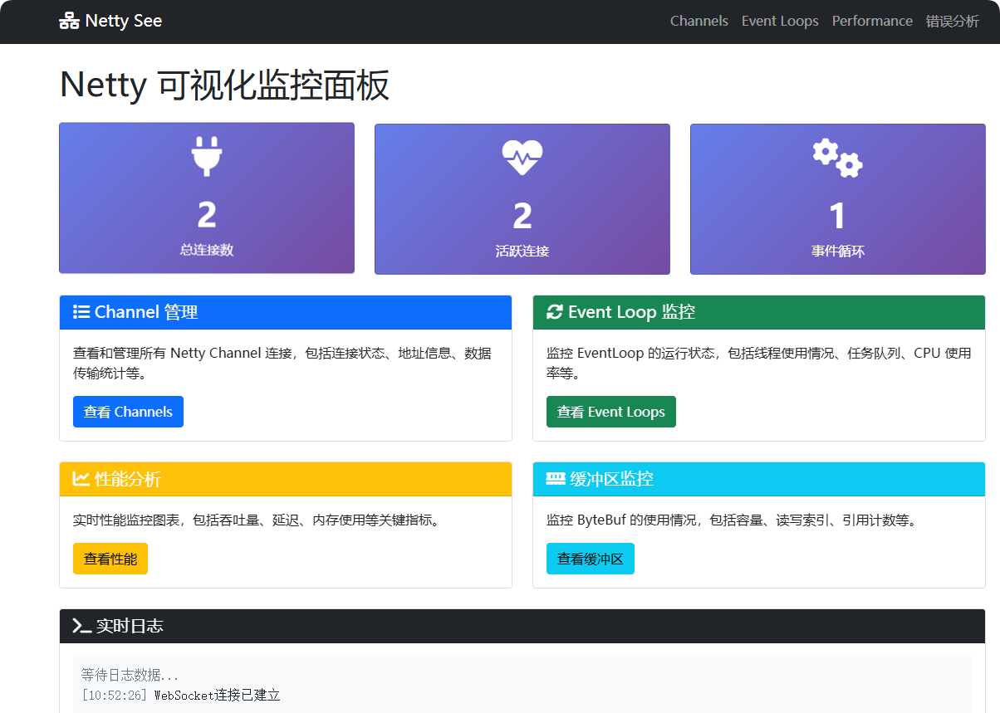
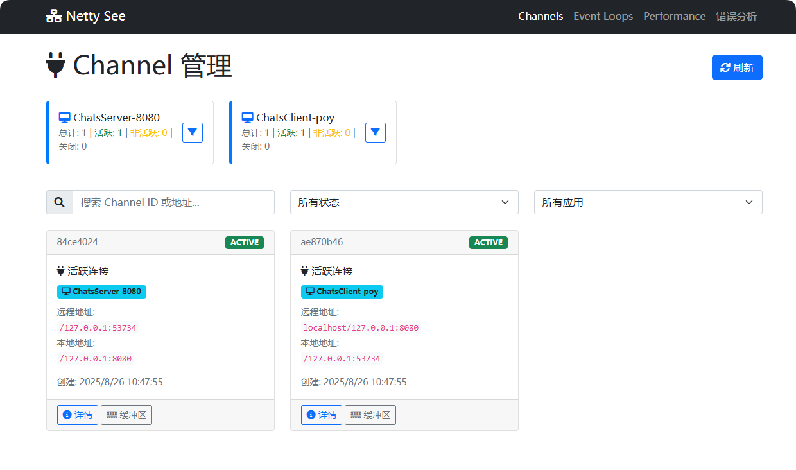
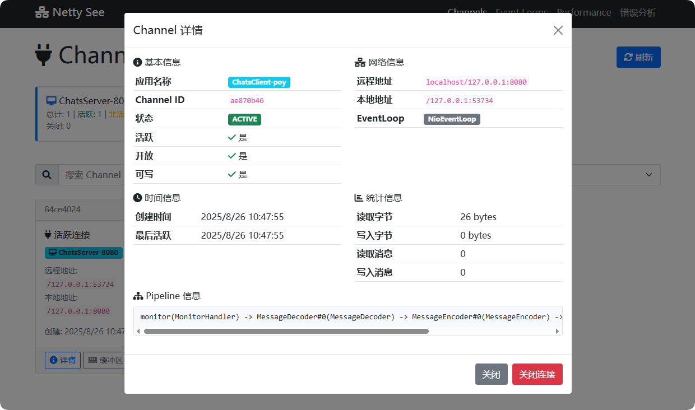
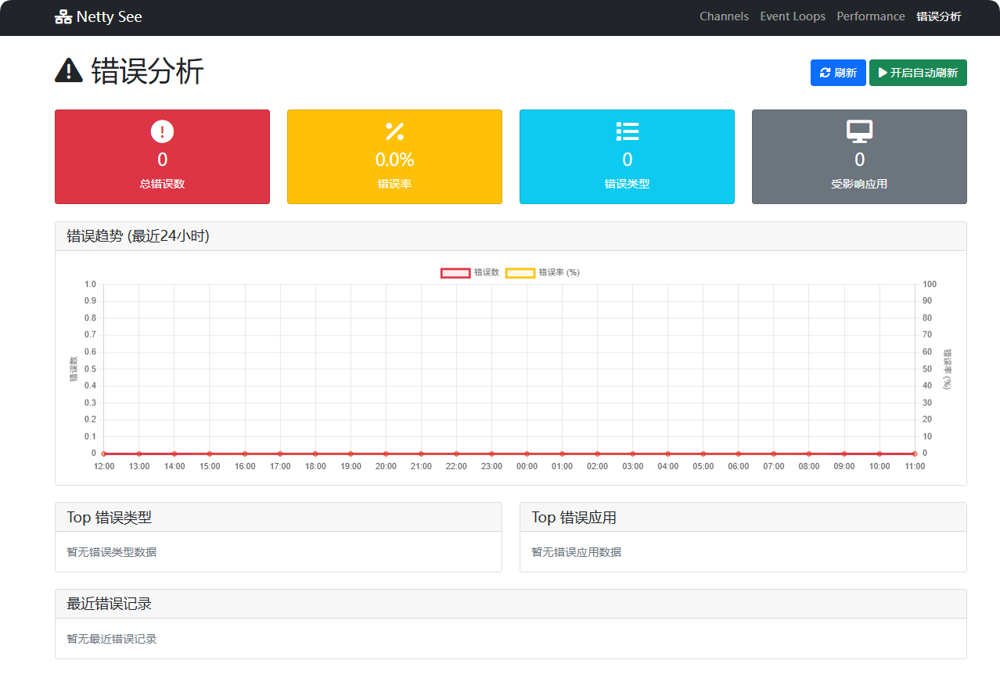

# Netty-See 监控系统

一个专为 Netty 应用设计的实时监控系统，提供 Channel 连接监控、性能分析和可视化展示功能。

> netty 版本 4.1.94.Final

## 🚀 核心特性

- **智能注解系统**：通过 `@NettyMonitor` 注解即可启用监控
- **动态模板解析**：支持 `${username}`、`${server.port}` 等动态变量
- **无侵入集成**：通过 Pipeline Handler 自动拦截，无需修改业务代码
- **实时监控**：TCP 长连接实时数据传输和 Web 控制台展示
- **高可用设计**：监控故障不影响业务系统，提供降级处理
- **延迟初始化**：支持延迟初始化和自动重试机制

## 📦 模块架构

```
09.netty-see/
├── agent/          # 监控代理模块 - 嵌入到目标应用中
├── console/        # Web控制台模块 - 集成监控服务器和可视化界面
```

## GUI









## 🎯 快速开始

### 1. 启动监控控制台
```bash
cd 09.netty-see/console
mvn spring-boot:run
```
访问 http://localhost:8081 查看监控面板

### 2. 在应用中集成监控

#### 方式1：注解方式（该方式尚未实现完全。开发中）
```
// 设置上下文变量
MonitorContextManager.setGlobalContext("username", "user1");
MonitorContextManager.setGlobalContext("server.port", "8080");

// 使用注解启用监控
@NettyMonitor(applicationName = "ChatsServer-${username}-${server.port}")
public class ChatsServer {
    public void start() {
        // 处理注解
        SmartMonitorAnnotationProcessor.getInstance().processClass(ChatsServer.class);
        
        // 在 Pipeline 中添加监控处理器
        if (NettyMonitorAgent.isInitialized()) {
            pipeline.addFirst("monitor", NettyMonitorAgent.getMonitorHandler());
        }
    }
}
```

#### 方式2：编程方式
```
// 初始化监控代理
NettyMonitorAgent.initialize("MyApp");

// 在 Pipeline 中添加监控处理器
pipeline.addFirst("monitor", NettyMonitorAgent.getMonitorHandler());
```

## Console - 监控面板

### API 接口

#### 监控数据接收

- `POST /api/monitor/data` - 接收监控代理发送的数据

#### 查询接口

##### 基础监控接口
- `GET /api/netty/channels` - 获取所有Channel信息
- `GET /api/netty/channels/{channelId}` - 获取指定Channel信息
- `GET /api/netty/eventloops` - 获取EventLoop信息
- `GET /api/netty/buffers` - 获取Buffer信息

##### 📊 统计分析接口
- `GET /api/statistics/realtime` - 实时统计数据
- `GET /api/statistics/timerange` - 时间范围统计
- `GET /api/statistics/recent/{minutes}` - 最近N分钟统计
- `GET /api/statistics/applications` - 应用维度统计
- `GET /api/statistics/eventloops` - EventLoop维度统计
- `GET /api/statistics/overview` - 统计概览
- `GET /api/statistics/performance` - 性能指标
- `GET /api/statistics/errors` - 错误统计

#### WebSocket

- `ws://localhost:8081/netty-data` - 实时数据推送

### 配置

#### application.yml

```yaml
server:
  port: 8081
  servlet:
    context-path: /

spring:
  application:
    name: netty-visualizer
  thymeleaf:
    cache: false
    mode: HTML
    encoding: UTF-8

logging:
  level:
    com.whosly.stars.netty.visualizer: DEBUG
    org.springframework.web.socket: DEBUG
```

#### 自定义端口

```bash
mvn spring-boot:run -Dspring-boot.run.arguments=--server.port=9090
```


## Monitor Agent
轻量级 Netty 监控代理库，用于收集和发送 Netty 应用程序的监控数据。

**特性**
- **轻量级**：最小依赖，不影响应用性能
- **自动监控**：自动收集 Channel 生命周期信息
- **数据上报**：通过 HTTP 发送监控数据到监控中心
- **易于集成**：只需几行代码即可集成

### 1. 添加依赖

```xml
<dependency>
    <groupId>com.yueny.study</groupId>
    <artifactId>netty-monitor-agent</artifactId>
    <version>1.0.0-SNAPSHOT</version>
</dependency>
```

### 2. 初始化监控

```java
// 在应用启动时初始化监控
NettyMonitor.initialize("MyNettyApp");
```

### 3. 添加监控Handler

```java
public class MyChannelInitializer extends ChannelInitializer<SocketChannel> {
    @Override
    protected void initChannel(SocketChannel ch) throws Exception {
        ChannelPipeline pipeline = ch.pipeline();
        
        // 添加监控Handler（建议放在pipeline的最前面）
        if (NettyMonitor.isInitialized()) {
            pipeline.addFirst("monitor", NettyMonitor.getMonitorHandler());
        }
        
        // 添加你的其他Handler
        pipeline.addLast(new MyBusinessHandler());
    }
}
```

### API 文档

**NettyMonitor**

主要的监控工具类。

#### 方法

- `initialize(String appName)` - 初始化监控，指定应用名称
- `initialize(String appName, String monitorUrl)` - 初始化监控，指定应用名称和监控中心URL
- `isInitialized()` - 检查监控是否已初始化
- `getMonitorHandler()` - 获取监控Handler实例
- `shutdown()` - 关闭监控

#### 示例

```java
// 基本初始化（默认发送到 http://localhost:8080）
NettyMonitor.initialize("MyApp");

// 自定义监控中心地址
NettyMonitor.initialize("MyApp", "http://monitor.example.com:8080");

// 检查是否已初始化
if (NettyMonitor.isInitialized()) {
    // 添加监控Handler
    pipeline.addFirst("monitor", NettyMonitor.getMonitorHandler());
}

// 应用关闭时清理资源
NettyMonitor.shutdown();
```


## 🔧 高级配置

### 注解配置选项
```java
@NettyMonitor(
    applicationName = "MyApp-${environment}-${version}",  // 支持动态变量
    host = "${monitor.host:localhost}",                   // 监控服务器地址
    port = 19999,                                         // 监控服务器端口
    lazyInit = true,                                      // 延迟初始化
    initTimeout = 10000,                                  // 初始化超时时间
    retryCount = 3,                                       // 重试次数
    retryInterval = 1000                                  // 重试间隔
)
public class MyNettyServer {
    // 服务器实现
}
```

### 上下文变量管理
```
// 设置全局上下文
MonitorContextManager.setGlobalContext("environment", "production");
MonitorContextManager.setGlobalContext("version", "1.0.0");

// 设置线程本地上下文
MonitorContextManager.setThreadContext("requestId", "req-123");

// 启用调试模式
MonitorContextManager.setDebugMode(true);
MonitorContextManager.dumpContext();
```

### 支持的变量语法
- `${variable}` - 从上下文或系统属性获取变量
- `${variable:default}` - 带默认值的变量
- `${methodName()}` - 调用对象方法获取值
- `${env.VARIABLE_NAME}` - 获取环境变量
- `${system.property}` - 获取系统属性

## 📊 监控数据

### Channel 信息
- Channel ID 和地址信息
- 连接状态和生命周期
- 数据传输统计（读写字节数）
- 用户关联和角色识别（CLIENT/SERVER）

### REST API
```bash
# 获取所有 Channel 信息
GET http://localhost:8081/api/netty/channels

# 获取统计信息
GET http://localhost:8081/api/netty/stats
```

## 🛠️ 开发和调试

### 获取处理器状态
```java
SmartMonitorAnnotationProcessor processor = SmartMonitorAnnotationProcessor.getInstance();

// 获取统计信息
int pendingCount = processor.getPendingInitializationCount();
int processedCount = processor.getProcessedClassCount();

// 获取错误统计
RetryErrorHandler.ErrorStatistics stats = processor.getErrorStatistics("MyClass");
```

### 模板验证
```java
TemplateResolver resolver = processor.getTemplateResolver();
TemplateResolver.ValidationResult result = resolver.validate("${username}-${server.port}");
System.out.println("模板有效: " + result.isValid());
```

## 🔍 故障排查

### 常见问题
1. **监控数据不显示**
   - 检查 NettyMonitorAgent 是否初始化成功
   - 确认 MonitorHandler 已添加到 Pipeline
   - 检查监控服务器是否运行（端口 19999）

2. **注解处理失败**
   - 检查上下文变量是否正确设置
   - 验证模板语法是否正确
   - 查看日志中的错误信息

3. **连接失败**
   - 检查网络连接和防火墙设置
   - 确认监控服务器地址和端口配置
   - 查看重试和错误处理日志


## 📚 项目文档

### 设计和架构文档
- [系统架构](../dream/docs/specs/netty-see/01-architecture.md) - 系统整体架构设计
- [功能需求](../dream/docs/specs/netty-see/02-requirements.md) - 项目功能需求分析
- [系统设计](../dream/docs/specs/netty-see/04-system-design.md) - 详细系统设计
- [缓冲区监控设计](../dream/docs/specs/netty-see/05-buffer-monitoring-design.md) - 缓冲区监控专项设计

### 用户手册
- [统计分析功能手册](../dream/docs/specs/netty-see/06-statistics-user-manual.md) - 统计分析功能详细使用指南

### 开发文档
- [实现状态](../dream/docs/specs/netty-see/03-implementation-status.md) - 当前功能实现状态跟踪
- [功能缺失分析](../dream/docs/specs/netty-see/07-missing-features-analysis.md) - 功能缺失深度分析
- [开发路线图](../dream/docs/specs/netty-see/08-development-roadmap.md) - 开发计划和里程碑
- [文档更新日志](../dream/docs/specs/netty-see/CHANGELOG.md) - 文档版本更新记录
 

## 🤝 贡献

欢迎提交 Issue 和 Pull Request 来改进这个项目！