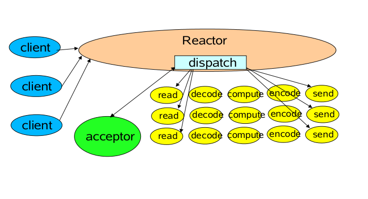
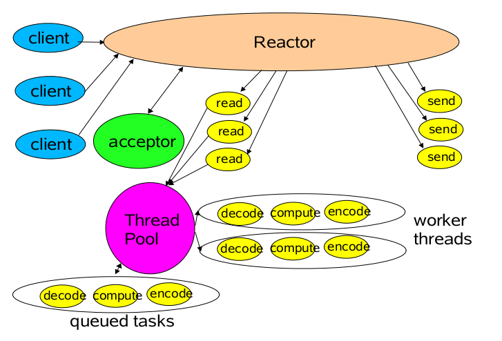
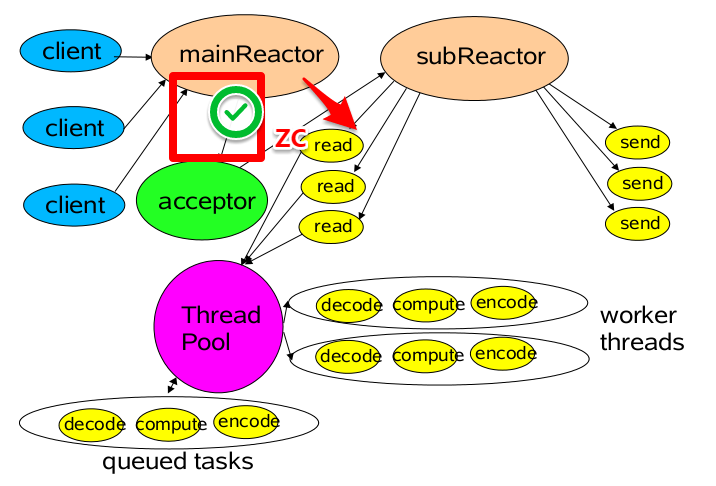
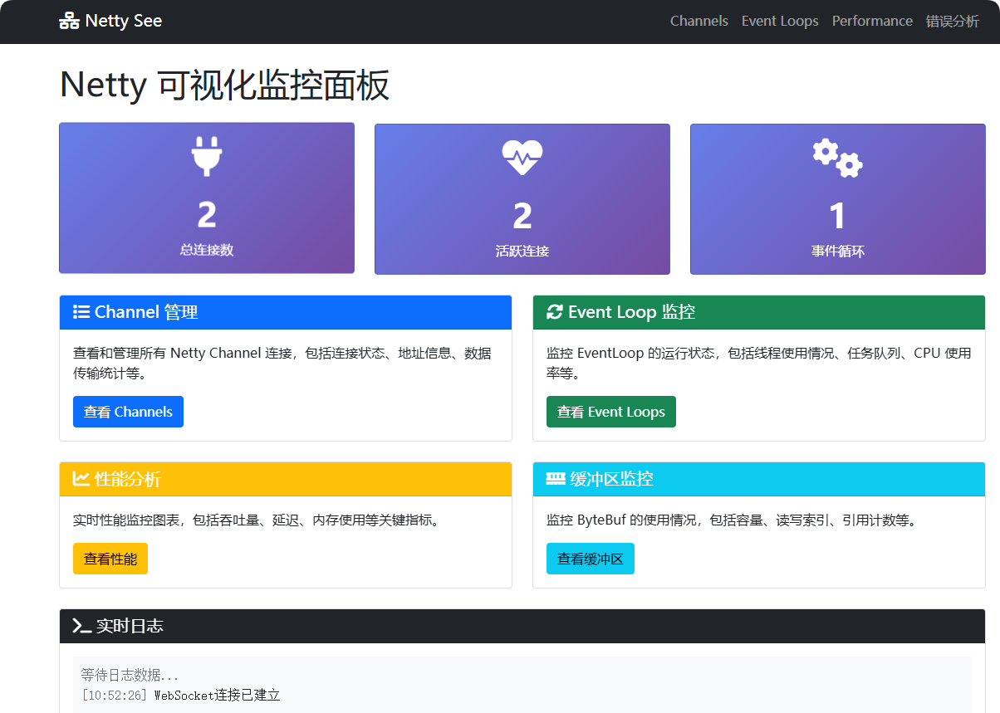
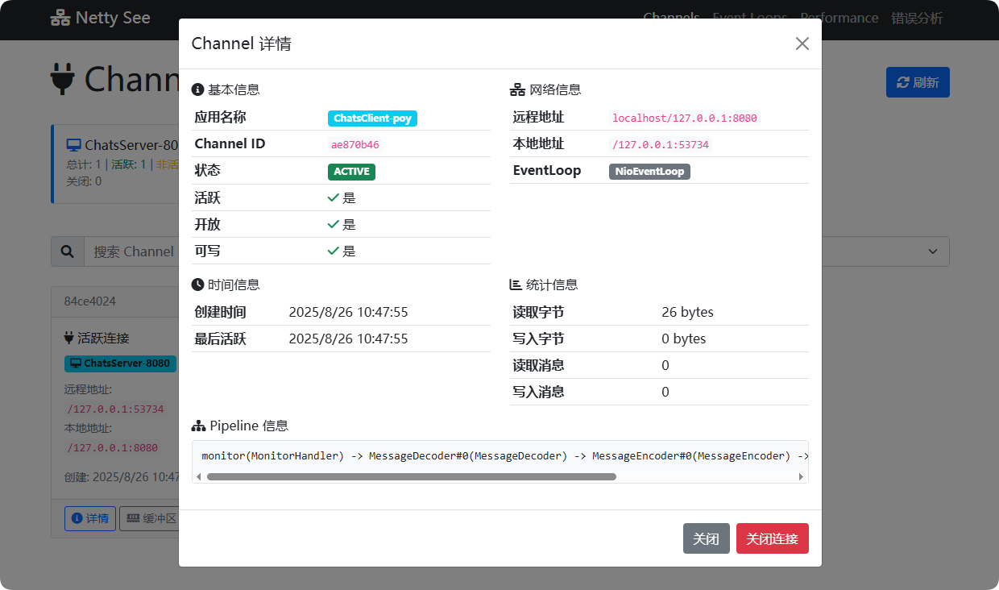

# Study-Netty
基于 JDK1.8 的 Netty 理论学习与实践项目

## 📋 Prerequisites
```
JDK 1.8+ (推荐 azul-1.8.0_442 或更高版本)
Maven 3.3.9 或更高版本
```

## About Netty
Netty是一个NIO客户端服务器框架：
* 它可快速轻松地开发网络应用程序，例如协议服务器和客户端。 
* 它极大地简化和简化了网络编程，例如TCP和UDP套接字服务器。

NIO是一种非阻塞IO ，它具有以下的特点
* 单线程可以连接多个客户端。
* 选择器可以实现但线程管理多个Channel，新建的通道都要向选择器注册。
* 一个SelectionKey键表示了一个特定的通道对象和一个特定的选择器对象之间的注册关系。
* selector进行select()操作可能会产生阻塞，但是可以设置阻塞时间，并且可以用wakeup()唤醒selector，所以NIO是非阻塞IO。

### 核心代码职能
ServerBootstrap – 用于引导服务器通道并启动服务器的代码。它将服务器绑定到将用于监听连接的端口。

Bootstrap – 用于引导客户端通道的代码。

EventLoopGroup –
* 是一组 EventLoop。一旦注册给某个 Channel，EventLoop 就会处理该通道的所有 I/O 操作。
* ServerBootstrap 需要两种类型的 EventLoopGroup，即 “boss” 和 “worker”。而 Client Bootstrap 不需要 boss 组。
* Boss EventLoopGroup – 这个事件循环组负责监听并接受传入的连接。
* Worker EventLoopGroup – Boss 接受连接后，将其注册到 worker EventLoopGroup。Worker 负责处理通过该连接进行通信期间的所有事件。

Channel（NioServerSocketChannel） – 配置服务器使用基于 NIO 选择器的实现来接受新连接。

解码器/编码器（StringDecoder / StringEncoder） –
* Netty 的通信是通过网络套接字通道进行的，数据以字节格式传输。因此，如果我们要发送特定类型的数据（如字符串），就需要提供编码器将数据类型编码为字节，以及解码器将字节解码回数据类型。
* Netty 提供了 String 编码器和解码器。但我们也可以为任何我们需要的数据类型创建自定义的编码器或解码器。

### Netty模型selector模式
它相对普通NIO的在性能上有了提升，采用了：
* NIO采用多线程的方式可以同时使用多个selector
* 通过绑定多个端口的方式，使得一个selector可以同时注册多个ServerSocketServer
* 单个线程下只能有一个selector，用来实现Channel的匹配及复用

> 半包问题: 
> TCP/IP在发送消息的时候，可能会拆包，这就导致接收端无法知道什么时候收到的数据是一个完整的数据。
> 在传统的BIO中在读取不到数据时会发生阻塞，但是NIO不会。
> 为了解决NIO的半包问题，Netty在Selector模型的基础上，提出了reactor模式，从而解决客户端请求在服务端不完整的问题。


### Netty模型reactor模式
reactor模式在selector模式的基础上解决了半包问题。

首先我们基于Reactor Pattern 处理模式中，定义以下三种角色:
* Reactor 负责响应IO事件，当检测到一个新的事件，将其分派给相应的Handler去处理；新的事件包含连接建立就绪、读就绪、写就绪等。 
* Acceptor 处理客户端新连接，并分派请求到处理器链中 
* Handlers 将自身与事件绑定，负责事件的处理，执行非阻塞读/写 任务

#### 单Reactor单线程模型
Reactor线程是个多面手，负责多路分离套接字，Accept新连接，并分派请求到Handler处理器中。



这是最基本的单Reactor单线程模型。其中Reactor线程，负责多路分离套接字，有新连接到来触发connect 事件之后，交由Acceptor进行处理，有IO读写事件之后交给hanlder 处理。

Acceptor主要任务就是构建handler ，在获取到和client相关的SocketChannel之后 ，绑定到相应的hanlder上，对应的SocketChannel有读写事件之后，基于reacotor 分发,hanlder就可以处理了（所有的IO事件都绑定到selector上，有Reactor分发）。

单线程模型的缺点：
1. 当其中某个 handler 阻塞时， 会导致其他所有的 client 的 handler 都得不到执行， 并且更严重的是， handler 的阻塞也会导致整个服务不能接收新的 client 请求(因为 acceptor 也被阻塞了)。 因为有这么多的缺陷， 因此单线程Reactor 模型用的比较少。这种单线程模型不能充分利用多核资源，所以实际使用的不多。
2. 因此，单线程模型仅仅适用于handler 中业务处理组件能快速完成的场景。

#### 单Reactor多线程模型

在单线程Reactor模式基础上，做如下改进：
1. 将Handler处理器的执行放入线程池，多线程进行业务处理。
2. 而对于Reactor而言，可以仍为单个线程。如果服务器为多核的CPU，为充分利用系统资源，可以将Reactor拆分为两个线程。



此模型可以充分利用多核CPU的处理能力，但是多线程数据共享和访问会比较复杂，Reactor在单线程里处理所有连接与事件的监听，以及事件分发，在高并发场景容易出现性能瓶颈，多线程仅仅解决业务处理的压力。

#### 多Reactor多线程模型
对于多个CPU的机器，为充分利用系统资源，将Reactor拆分为两部分。

1. mainReactor负责监听server socket，用来处理新连接的建立，将建立的socketChannel指定注册给subReactor。
2. subReactor维护自己的selector, 基于mainReactor 注册的socketChannel多路分离IO读写事件，读写网 络数据，对业务处理的功能，另其扔给worker线程池来完成。



上图，简单地可以描述为 "boss接活，让work干"：manReactor用来接收请求（会与客户端进行握手验证），而subReactor用来处理请求（不与客户端直接连接）。


## 📚 项目模块

### 🚀 基础入门模块

#### 01.server-and-client
**Echo 服务器和客户端基础实现**
- 构建最基本的 Echo Server 和 Client
- 学习 Netty 的基本使用方式
- 理解服务器-客户端通信模型

#### 02.server-and-client-application
**完整的 Echo 应用程序**
- 使用 `exec-maven-plugin` 插件的完整应用
- 支持 Maven 面板运行和调试
- 📖 [使用手册](./02.server-and-client-application/Usage.md)

#### 03.handler-decoder
**编解码器实践**
- RequestData 的编码器和解码器实现
- 学习自定义数据格式的处理
- 理解 Netty 的编解码机制

### 💬 聊天应用模块

#### 04.chat
**基础聊天系统**
- 控制台输入的聊天客户端应用
- 支持多客户端同时聊天
- 消息广播功能
- 📖 [详细文档](./04.chat/README.md)

**核心功能：**
- 客户端启动时输入用户名
- 实时消息发送和接收
- 服务器向所有客户端广播消息
- 支持增强版私聊功能

#### 05.chats
**高级聊天室系统**
- 基于自定义 `Message` 数据结构的群聊系统
- 昵称显示与系统提示功能
- 支持命令操作（如 `/name` 修改昵称）
- 📖 [使用指南](./05.chats/README.md)

**特色功能：**
- 昵称显示为【昵称】而非【IP】
- 离线通知和用户加入/离开提示
- 零侵入配置，自动回退默认值
- 基于 DelimiterBasedFrameDecoder 的文本协议

### 🔧 核心技术模块

#### 06.netty-buffer
**ByteBuf 缓冲区深度学习**
- Netty ByteBuf 的完整实现和优化
- 解决 JDK ByteBuffer 的局限性
- 📖 [详细文档](./06.netty-buffer/README.md)

**核心优势：**
- 可扩展的自定义缓冲区类型
- 透明的零拷贝复合缓冲区
- 容量按需增长，无需 flip() 方法
- 独立的读写索引，支持方法链式调用
- 引用计数和池化支持

**实现内容：**
- ByteBuf 分配器（Pooled/Unpooled）
- 堆缓冲区、直接缓冲区、复合缓冲区
- 数据遍历、写入、索引管理、复制分片操作

#### 07.netty-channel
**Channel 通道全面解析**
- Netty Channel 的核心概念和生命周期
- 多种 Channel 类型的实现和应用场景
- 📖 [完整指南](./07.netty-channel/README.md)

**Channel 类型覆盖：**
- **ServerSocketChannel**: TCP 服务器端监听（含回环通信示例）
- **SocketChannel**: TCP 客户端连接（含心跳机制）
- **LocalServerChannel**: 同 JVM 进程间通信（IPC）
- **DomainSocketChannel**: Unix 域套接字通信（Linux/macOS）
- **FileChannel**: 文件 I/O 操作
- **EmbeddedChannel**: 单元测试专用通道
- **DatagramChannel**: UDP 通信（点对点、广播、多播）

### 🔍 高级特性模块

#### 08.selector
**NIO Selector 选择器机制**
- Java NIO 中 Selector 的非阻塞 I/O 实现
- 单线程处理多客户端连接的核心原理
- 事件驱动的网络编程模式

**核心特性：**
- 减少系统开销，避免多线程上下文切换
- 事件检测和处理机制
- 高效的连接管理

#### 09.netty-see
**🎯 Netty 实时监控系统**
- 专为 Netty 应用设计的完整监控解决方案
- 智能注解系统和动态模板解析
- 📖 [完整文档](./09.netty-see/README.md)





**核心特性：**
- **智能注解**: `@NettyMonitor` 注解即可启用监控
- **动态模板**: 支持 `${username}`、`${server.port}` 等变量
- **无侵入集成**: Pipeline Handler 自动拦截
- **实时监控**: TCP 长连接 + Web 控制台
- **高可用设计**: 监控故障不影响业务
- **延迟初始化**: 自动重试和降级处理

**模块架构：**
- `agent/`: 监控代理模块（嵌入目标应用）
- `console/`: Web 控制台（集成监控服务器和可视化）
- `server/`: 独立监控服务器（可选）

#### 11.netty-capacity
**Netty 性能和容量测试**
- 性能基准测试和容量规划
- 不同场景下的性能优化实践

### 🛠️ 工具模块

#### core
**核心工具和通用组件**
- 项目通用的工具类和基础组件
- 为其他模块提供基础支持

#### utils
**实用工具集合**
- 通用工具类库
- 为整个项目提供基础工具支持


## 🚀 快速开始

### 构建项目

**构建所有模块：**
```bash
mvn clean install
```

**构建单个模块：**
```bash
# 首先构建基础工具模块
mvn install -pl utils

# 然后构建特定模块，例如：
mvn install -pl 05.chats
mvn install -pl 09.netty-see
```

### 运行示例

**1. 聊天系统体验：**
```bash
# 启动聊天服务器
cd 05.chats
mvn exec:java -Dexec.mainClass="com.yueny.stars.netty.chats.server.ChatsServer"

# 启动聊天客户端（新终端）
mvn exec:java -Dexec.mainClass="com.yueny.stars.netty.chats.client.ChatsClient"
```

**2. 监控系统体验：**
```bash
# 启动监控控制台
cd 09.netty-see/console
mvn spring-boot:run

# 访问 http://localhost:8081 查看监控面板
```

**3. Channel 示例体验：**
```bash
# TCP Socket 通信示例
cd 07.netty-channel
mvn exec:java -Dexec.mainClass="com.yueny.stars.netty.channel.socket.SocketTcpServer"
mvn exec:java -Dexec.mainClass="com.yueny.stars.netty.channel.socket.SocketTcpClient"

# UDP 通信示例
mvn exec:java -Dexec.mainClass="com.yueny.stars.netty.channel.datagram.pointtopoint.UdpServer"
mvn exec:java -Dexec.mainClass="com.yueny.stars.netty.channel.datagram.pointtopoint.UdpClient"
```

## 🎯 学习路径推荐

### 初学者路径
1. **基础概念** → `01.server-and-client` - 了解 Netty 基本使用
2. **编解码器** → `03.handler-decoder` - 学习数据处理
3. **实际应用** → `04.chat` - 构建简单聊天系统
4. **缓冲区管理** → `06.netty-buffer` - 深入 ByteBuf 机制

### 进阶路径
1. **Channel 深入** → `07.netty-channel` - 掌握各种 Channel 类型
2. **高级聊天** → `05.chats` - 实现复杂聊天功能
3. **NIO 原理** → `08.selector` - 理解底层 NIO 机制
4. **监控系统** → `09.netty-see` - 构建生产级监控

### 实战项目
- **聊天系统**：从 `04.chat` 到 `05.chats` 的完整演进
- **监控系统**：`09.netty-see` 的完整监控解决方案
- **性能测试**：`11.netty-capacity` 的性能基准测试

## 📖 相关资源

- [Netty 官方文档](https://netty.io/wiki/)
- [Java NIO 教程](https://docs.oracle.com/javase/tutorial/essential/io/nio.html)
- [项目 Issues](https://github.com/your-repo/issues) - 问题反馈和讨论
