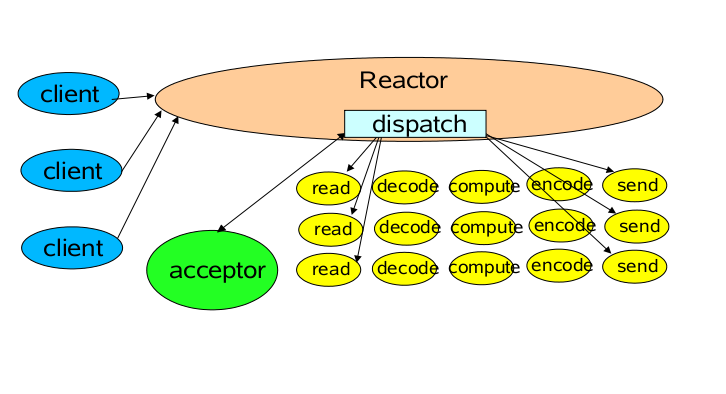
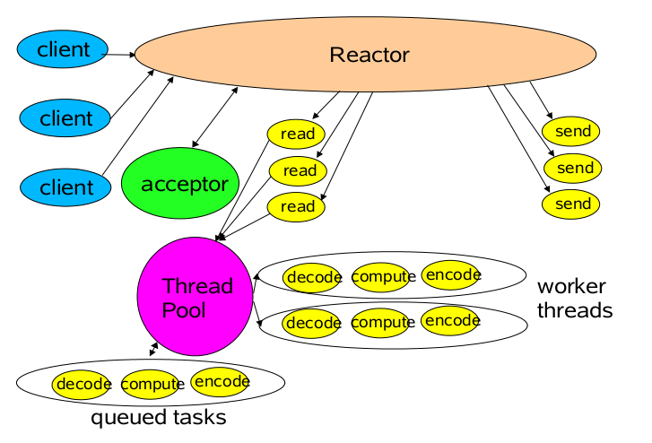
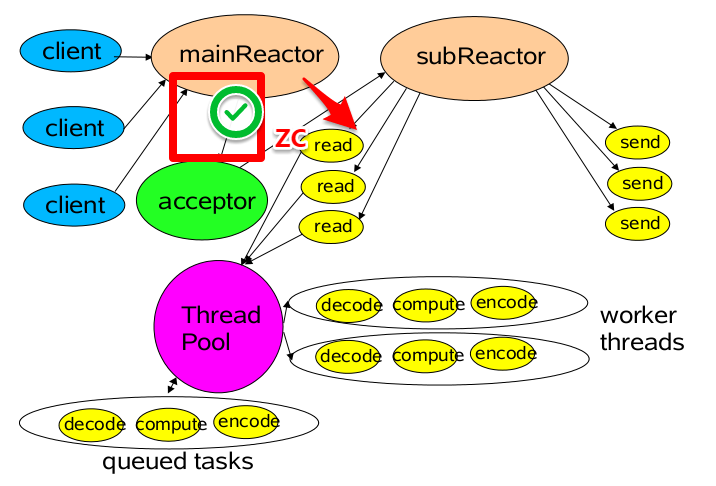

# study-netty
基于 JDK1.8 的 netty 理论学习

## Prerequisites
```
azul-1.8.0_442 or better

Maven 3.3.9 or better
```

## About Netty
Netty是一个NIO客户端服务器框架：
* 它可快速轻松地开发网络应用程序，例如协议服务器和客户端。 
* 它极大地简化和简化了网络编程，例如TCP和UDP套接字服务器。

NIO是一种非阻塞IO ，它具有以下的特点
* 单线程可以连接多个客户端。
* 选择器可以实现但线程管理多个Channel，新建的通道都要向选择器注册。
* 一个SelectionKey键表示了一个特定的通道对象和一个特定的选择器对象之间的注册关系。
* selector进行select()操作可能会产生阻塞，但是可以设置阻塞时间，并且可以用wakeup()唤醒selector，所以NIO是非阻塞IO。

### 核心代码职能
ServerBootstrap – 用于引导服务器通道并启动服务器的代码。它将服务器绑定到将用于监听连接的端口。

Bootstrap – 用于引导客户端通道的代码。

EventLoopGroup –
* 是一组 EventLoop。一旦注册给某个 Channel，EventLoop 就会处理该通道的所有 I/O 操作。
* ServerBootstrap 需要两种类型的 EventLoopGroup，即 “boss” 和 “worker”。而 Client Bootstrap 不需要 boss 组。
* Boss EventLoopGroup – 这个事件循环组负责监听并接受传入的连接。
* Worker EventLoopGroup – Boss 接受连接后，将其注册到 worker EventLoopGroup。Worker 负责处理通过该连接进行通信期间的所有事件。

Channel（NioServerSocketChannel） – 配置服务器使用基于 NIO 选择器的实现来接受新连接。

解码器/编码器（StringDecoder / StringEncoder） –
* Netty 的通信是通过网络套接字通道进行的，数据以字节格式传输。因此，如果我们要发送特定类型的数据（如字符串），就需要提供编码器将数据类型编码为字节，以及解码器将字节解码回数据类型。
* Netty 提供了 String 编码器和解码器。但我们也可以为任何我们需要的数据类型创建自定义的编码器或解码器。

### Netty模型selector模式
它相对普通NIO的在性能上有了提升，采用了：
* NIO采用多线程的方式可以同时使用多个selector
* 通过绑定多个端口的方式，使得一个selector可以同时注册多个ServerSocketServer
* 单个线程下只能有一个selector，用来实现Channel的匹配及复用

> 半包问题: 
> TCP/IP在发送消息的时候，可能会拆包，这就导致接收端无法知道什么时候收到的数据是一个完整的数据。
> 在传统的BIO中在读取不到数据时会发生阻塞，但是NIO不会。
> 为了解决NIO的半包问题，Netty在Selector模型的基础上，提出了reactor模式，从而解决客户端请求在服务端不完整的问题。


### Netty模型reactor模式
reactor模式在selector模式的基础上解决了半包问题。

首先我们基于Reactor Pattern 处理模式中，定义以下三种角色:
* Reactor 负责响应IO事件，当检测到一个新的事件，将其分派给相应的Handler去处理；新的事件包含连接建立就绪、读就绪、写就绪等。 
* Acceptor 处理客户端新连接，并分派请求到处理器链中 
* Handlers 将自身与事件绑定，负责事件的处理，执行非阻塞读/写 任务

#### 单Reactor单线程模型
Reactor线程是个多面手，负责多路分离套接字，Accept新连接，并分派请求到Handler处理器中。



这是最基本的单Reactor单线程模型。其中Reactor线程，负责多路分离套接字，有新连接到来触发connect 事件之后，交由Acceptor进行处理，有IO读写事件之后交给hanlder 处理。

Acceptor主要任务就是构建handler ，在获取到和client相关的SocketChannel之后 ，绑定到相应的hanlder上，对应的SocketChannel有读写事件之后，基于reacotor 分发,hanlder就可以处理了（所有的IO事件都绑定到selector上，有Reactor分发）。

单线程模型的缺点：
1. 当其中某个 handler 阻塞时， 会导致其他所有的 client 的 handler 都得不到执行， 并且更严重的是， handler 的阻塞也会导致整个服务不能接收新的 client 请求(因为 acceptor 也被阻塞了)。 因为有这么多的缺陷， 因此单线程Reactor 模型用的比较少。这种单线程模型不能充分利用多核资源，所以实际使用的不多。
2. 因此，单线程模型仅仅适用于handler 中业务处理组件能快速完成的场景。

#### 单Reactor多线程模型

在单线程Reactor模式基础上，做如下改进：
1. 将Handler处理器的执行放入线程池，多线程进行业务处理。
2. 而对于Reactor而言，可以仍为单个线程。如果服务器为多核的CPU，为充分利用系统资源，可以将Reactor拆分为两个线程。



此模型可以充分利用多核CPU的处理能力，但是多线程数据共享和访问会比较复杂，Reactor在单线程里处理所有连接与事件的监听，以及事件分发，在高并发场景容易出现性能瓶颈，多线程仅仅解决业务处理的压力。

#### 多Reactor多线程模型
对于多个CPU的机器，为充分利用系统资源，将Reactor拆分为两部分。

1. mainReactor负责监听server socket，用来处理新连接的建立，将建立的socketChannel指定注册给subReactor。
2. subReactor维护自己的selector, 基于mainReactor 注册的socketChannel多路分离IO读写事件，读写网 络数据，对业务处理的功能，另其扔给worker线程池来完成。



上图，简单地可以描述为 "boss接活，让work干"：manReactor用来接收请求（会与客户端进行握手验证），而subReactor用来处理请求（不与客户端直接连接）。


## Modules

### 01.server-and-client
Build an Echo Server and Client

### 02.server-and-client-application
Build an Echo Server and Client Netty Application， 手册：[Echo Server and Client Netty Application](./02.server-and-client-application/Usage.md)

### 03.handler-decoder
Encoders and Decoders for RequestData

### 04.chat
Chat Server-Client application using Netty， 手册：[Chat Server-Client application using Netty](./04.chat/Usage.md)

### 05.chats
聊天室项目，实现多为用户(client)的互通互撩，以用户名的形式呈现， 手册：[Chats](./05.chats/Read.md)

### 06.netty-capacity
NETTY内存分配器类


## Build

If you want to build everything at once, from the top directory run `mvn install`.
If you want to build only single projects then from the top directory first run  `mvn install -pl utils`.
