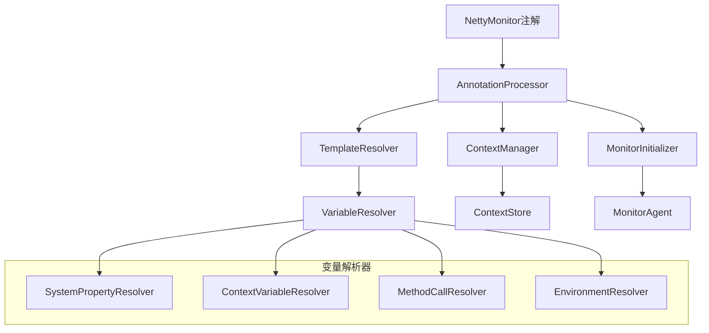
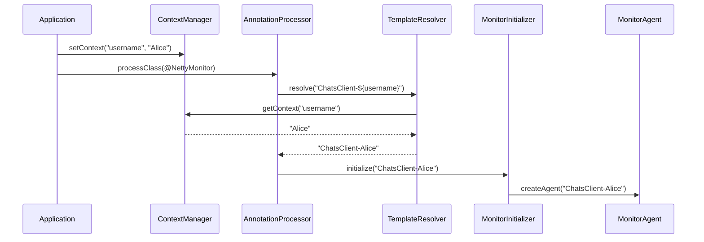

# Netty-See 监控系统设计文档

## 概述

Netty-See 是一个专为 Netty 应用设计的实时监控系统，提供 Channel 连接监控、性能分析和可视化展示功能。本文档描述了系统的完整设计架构，包括智能注解处理、模板解析、错误处理和可视化控制台等核心组件。

### 核心设计理念
- **简单易用**：通过 @NettyMonitor 注解即可启用监控，无需复杂配置
- **零依赖**：Agent 模块只依赖 netty-all，避免依赖冲突
- **智能化**：支持动态模板解析、自动重连、延迟初始化
- **轻量级**：内置简单的 JSON 和日志工具，最小化资源占用
- **高可用**：监控故障不影响业务系统，提供降级处理机制
- **实时性**：实时数据收集和传输，Web 控制台实时展示
- **缓冲区监控**：实时监控 ByteBuf 使用情况和内存管理


## 架构设计 Architecture


### 整体架构

```
┌─────────────────────────────────────────────────────────────┐
│                    User Application                         │
├─────────────────────────────────────────────────────────────┤
│  @NettyMonitor Annotation  │  Manual API  │  Auto Scanning │
├─────────────────────────────────────────────────────────────┤
│              MonitorAnnotationProcessor                     │
├─────────────────────────────────────────────────────────────┤
│                    MonitorAgent                             │
│  ┌─────────────────┐  ┌─────────────────┐  ┌─────────────┐ │
│  │  Connection     │  │   Data          │  │   Lifecycle │ │
│  │  Management     │  │   Collection    │  │   Management│ │
│  └─────────────────┘  └─────────────────┘  └─────────────┘ │
├─────────────────────────────────────────────────────────────┤
│                    Utility Layer                           │
│  ┌─────────────────┐  ┌─────────────────┐  ┌─────────────┐ │
│  │    JsonUtil     │  │     Logger      │  │   Others    │ │
│  └─────────────────┘  └─────────────────┘  └─────────────┘ │
├─────────────────────────────────────────────────────────────┤
│                      Netty Core                            │
└─────────────────────────────────────────────────────────────┘
```

### 项目模块结构

```
09.netty-see/
├── agent/                                       # 监控代理模块
│   └── src/main/java/com/yueny/stars/netty/monitor/agent/
│       ├── annotation/
│       │   ├── NettyMonitor.java                # 监控注解定义
│       │   └── NettyMonitorValidator.java       # 注解验证器
│       ├── context/
│       │   └── MonitorContextManager.java       # 上下文管理器
│       ├── core/
│       │   ├── MonitorAgent.java                # 监控代理核心类
│       │   └── MonitorHandler.java              # 监控数据收集Handler
│       ├── model/
│       │   ├── ChannelInfo.java                 # Channel信息模型
│       │   └── MonitorMessage.java              # 监控消息模型
│       ├── processor/
│       │   ├── SmartMonitorAnnotationProcessor.java  # 智能注解处理器
│       │   ├── MonitorAnnotationProcessor.java       # 基础注解处理器
│       │   ├── RetryErrorHandler.java                # 重试错误处理器
│       │   ├── RetryStrategy.java                    # 重试策略
│       │   ├── NoOpMonitor.java                      # 降级监控器
│       │   └── LazyInitializationManager.java        # 延迟初始化管理器
│       ├── template/
│       │   ├── TemplateResolver.java            # 模板解析器
│       │   ├── VariableResolver.java            # 变量解析器接口
│       │   ├── TemplateDebugger.java            # 模板调试器
│       │   └── resolver/
│       │       ├── ContextVariableResolver.java      # 上下文变量解析器
│       │       ├── MethodCallResolver.java           # 方法调用解析器
│       │       ├── EnvironmentResolver.java          # 环境变量解析器
│       │       └── SystemPropertyResolver.java      # 系统属性解析器
│       ├── util/
│       │   ├── JsonUtil.java                    # JSON工具类
│       │   └── Logger.java                     # 日志工具类
│       ├── NettyMonitorAgent.java               # 主入口类
│       ├── LocalMonitorAgent.java               # 本地监控代理
│       └── LocalMonitorHandler.java             # 本地监控处理器
├── console/                                     # Web控制台模块
│   └── src/main/java/com/yueny/stars/netty/visualizer/
│       ├── controller/
│       │   ├── NettyVisualizerController.java   # REST API控制器
│       │   └── WebController.java               # Web页面控制器
│       ├── service/
│       │   └── NettyMonitorService.java         # 监控业务服务
│       ├── server/
│       │   └── LocalMonitorServer.java          # 监控数据接收服务器
│       ├── model/
│       │   ├── ChannelInfo.java                 # Channel信息模型
│       │   └── MonitorData.java                 # 监控数据模型
│       ├── config/
│       │   └── WebConfig.java                   # Web配置
│       ├── task/
│       │   └── MonitorDataCleanupTask.java      # 数据清理任务
│       ├── integration/
│       │   └── MonitorDataIntegration.java      # 数据集成
│       ├── example/
│       │   └── ExampleDataGenerator.java        # 示例数据生成器
│       └── NettySeeApplication.java             # Spring Boot主类
└── server/                                      # 独立监控服务器模块（可选）
```


### 核心组件架构



### 数据流设计



## 核心组件设计

### 1. NettyMonitor 注解 - 已实现 ✅

```java
@Target({ElementType.TYPE, ElementType.METHOD})
@Retention(RetentionPolicy.RUNTIME)
public @interface NettyMonitor {
    /**
     * 应用名称，向后兼容性：如果设置了value，则优先使用value
     */
    String value() default "";
    
    /**
     * 应用名称模板，支持变量替换
     * 支持的语法：
     * - ${variable} - 从上下文或系统属性获取变量
     * - ${variable:default} - 带默认值的变量
     * - ${methodName()} - 调用对象方法获取值
     * - ${field.methodName()} - 调用字段对象的方法
     * - ${env.VARIABLE_NAME} - 获取环境变量
     * - ${system.property} - 获取系统属性
     */
    String applicationName() default "${class.simpleName}";
    
    /**
     * 监控服务器地址模板，支持变量替换
     */
    String host() default "${monitor.host:localhost}";
    
    /**
     * 监控服务器端口，默认19999
     */
    int port() default 19999;
    
    /**
     * 是否启用监控，默认true
     */
    boolean enabled() default true;
    
    /**
     * 是否启用延迟初始化
     */
    boolean lazyInit() default true;
    
    /**
     * 初始化超时时间（毫秒），默认5000ms
     */
    int initTimeout() default 5000;
    
    /**
     * 连接超时时间（毫秒），默认5000ms
     */
    int connectTimeout() default 5000;
    
    /**
     * 重连间隔（秒），默认5秒
     */
    int reconnectInterval() default 5;
    
    /**
     * 初始化重试次数，默认3次
     */
    int retryCount() default 3;
    
    /**
     * 重试间隔（毫秒），默认1000ms
     */
    int retryInterval() default 1000;
}
```

### 2. 上下文管理器 - 已实现 ✅

```java
public class MonitorContextManager {
    // 线程本地上下文
    private static final ThreadLocal<Map<String, Object>> THREAD_CONTEXT = 
            ThreadLocal.withInitial(ConcurrentHashMap::new);
    
    // 全局上下文
    private static final Map<String, Object> GLOBAL_CONTEXT = new ConcurrentHashMap<>();
    
    /**
     * 设置全局上下文变量
     */
    public static void setGlobalContext(String key, Object value);
    
    /**
     * 设置线程本地上下文变量
     */
    public static void setThreadContext(String key, Object value);
    
    /**
     * 获取上下文变量（优先级：线程本地 > 全局 > 系统属性）
     */
    public static Object getContext(String key);
    
    /**
     * 批量设置全局上下文
     */
    public static void setGlobalContexts(Map<String, Object> contexts);
    
    /**
     * 批量设置线程本地上下文
     */
    public static void setThreadContexts(Map<String, Object> contexts);
    
    /**
     * 移除上下文变量
     */
    public static Object removeGlobalContext(String key);
    public static Object removeThreadContext(String key);
    
    /**
     * 清空上下文
     */
    public static void clearGlobalContext();
    public static void clearThreadContext();
    
    /**
     * 调试支持
     */
    public static void setDebugMode(boolean enabled);
    public static void dumpContext();
}
```

### 3. 模板解析器 - 已实现 ✅

```java
public class TemplateResolver {
    // 模板变量正则表达式：${variable} 或 ${variable:defaultValue}
    private static final Pattern VARIABLE_PATTERN = Pattern.compile("\\$\\{([^}]+)\\}");
    
    // 变量解析器列表（按优先级排序）
    private final List<VariableResolver> resolvers;
    
    // 解析结果缓存
    private final Map<String, String> cache = new ConcurrentHashMap<>();
    
    /**
     * 解析模板字符串
     * 支持格式：${variable}, ${variable:defaultValue}, ${method()}
     */
    public String resolve(String template, Object instance);
    
    /**
     * 验证模板语法
     */
    public ValidationResult validate(String template);
    
    /**
     * 缓存管理
     */
    public void setCacheEnabled(boolean enabled);
    public void clearCache();
    public int getCacheSize();
    
    /**
     * 解析器管理
     */
    public void addResolver(VariableResolver resolver);
    public void removeResolver(Class<? extends VariableResolver> resolverClass);
    public List<VariableResolver> getResolvers();
}

// 变量解析器接口
public interface VariableResolver {
    boolean canResolve(String variable);
    Object resolve(String variableExpression, Object instance);
    int getPriority(); // 解析器优先级
    String getName(); // 解析器名称
}
```

### 4. 智能注解处理器 - 已实现 ✅

```java
public class SmartMonitorAnnotationProcessor {
    // 单例实例
    private static volatile SmartMonitorAnnotationProcessor instance;
    
    // 核心组件
    private final TemplateResolver templateResolver;
    private final NettyMonitorValidator validator;
    private final RetryErrorHandler retryErrorHandler;
    
    // 状态管理
    private final Map<String, PendingInitialization> pendingInits = new ConcurrentHashMap<>();
    private final Map<String, ProcessedClass> processedClasses = new ConcurrentHashMap<>();
    private final Map<String, NoOpMonitor> noOpMonitors = new ConcurrentHashMap<>();
    
    // 定时任务执行器
    private final ScheduledExecutorService scheduler = Executors.newScheduledThreadPool(2);
    
    /**
     * 获取单例实例
     */
    public static SmartMonitorAnnotationProcessor getInstance();
    
    /**
     * 处理类级别注解
     */
    public ProcessResult processClass(Class<?> clazz);
    
    /**
     * 延迟初始化处理
     */
    public ProcessResult processLazyInitialization(Class<?> clazz, NettyMonitor annotation);
    
    /**
     * 重试失败的初始化
     */
    public void retryFailedInitializations();
    
    /**
     * 降级处理
     */
    public NoOpMonitor getNoOpMonitor(String className);
    
    /**
     * 统计信息
     */
    public RetryErrorHandler.ErrorStatistics getErrorStatistics(String context);
    public int getPendingInitializationCount();
    public int getProcessedClassCount();
    
    /**
     * 资源管理
     */
    public void clearCache();
    public void shutdown();
}
```

### 5. 内置变量解析器 - 已实现 ✅

#### ContextVariableResolver (优先级: 10)
```java
public class ContextVariableResolver implements VariableResolver {
    // 解析 ${contextKey} 和 ${contextKey:default}
    public Object resolve(String variableExpression, Object instance) {
        String[] parts = variableExpression.split(":", 2);
        String variableName = parts[0].trim();
        String defaultValue = parts.length > 1 ? parts[1].trim() : null;
        
        Object value = MonitorContextManager.getContext(variableName);
        return value != null ? value : defaultValue;
    }
}
```

#### MethodCallResolver (优先级: 20)
```java
public class MethodCallResolver implements VariableResolver {
    // 解析 ${methodName()} 和 ${field.methodName()}
    public Object resolve(String variableExpression, Object instance) {
        // 支持方法调用语法解析
        // 使用反射调用对象方法或字段方法
        // 处理异常和类型转换
    }
}
```

#### EnvironmentResolver (优先级: 40)
```java
public class EnvironmentResolver implements VariableResolver {
    // 解析 ${env.VARIABLE_NAME} 和 ${env.VARIABLE_NAME:default}
    public Object resolve(String variableExpression, Object instance) {
        // 从环境变量获取值
        // 支持默认值语法
    }
}
```

#### SystemPropertyResolver (优先级: 50)
```java
public class SystemPropertyResolver implements VariableResolver {
    // 解析 ${system.property} 和 ${system.property:default}
    public Object resolve(String variableExpression, Object instance) {
        String[] parts = variableExpression.split(":", 2);
        String propertyName = parts[0].trim();
        String defaultValue = parts.length > 1 ? parts[1].trim() : null;
        
        return System.getProperty(propertyName, defaultValue);
    }
}
```

### 6. 错误处理与重试机制 - 已实现 ✅

#### RetryErrorHandler
```java
public class RetryErrorHandler {
    // 错误分类
    public enum ErrorType {
        NETWORK_ERROR,      // 网络连接错误
        RESOURCE_ERROR,     // 资源不足错误
        CONFIG_ERROR,       // 配置错误
        PERMISSION_ERROR,   // 权限错误
        UNKNOWN_ERROR       // 未知错误
    }
    
    // 重试决策
    public static class RetryDecision {
        private final boolean shouldRetry;
        private final long delayMs;
        private final String reason;
        // getter methods...
    }
    
    /**
     * 记录错误并返回重试决策
     */
    public RetryDecision recordError(String context, Exception error, int attemptCount);
    
    /**
     * 错误分类
     */
    public ErrorType classifyError(Exception error);
    
    /**
     * 获取错误统计信息
     */
    public ErrorStatistics getErrorStatistics(String context);
    
    /**
     * 清理过期统计数据
     */
    public void cleanupExpiredStats(long maxAgeMs);
}
```

#### NoOpMonitor (降级处理器)
```java
public class NoOpMonitor {
    private final String className;
    private final String reason;
    private final long createTime;
    
    /**
     * 提供空操作实现，确保业务不受监控故障影响
     */
    public void handleChannelActive(ChannelHandlerContext ctx);
    public void handleChannelInactive(ChannelHandlerContext ctx);
    public void handleChannelRead(ChannelHandlerContext ctx, Object msg);
    // 其他空操作方法...
}
```

### 7. Console 模块组件 - 已实现 ✅

#### LocalMonitorServer (监控数据接收)
```java
public class LocalMonitorServer {
    /**
     * 监听 TCP 端口 19999
     * 接收来自 Agent 的监控数据
     * JSON 数据解析和处理
     */
    public void start(int port);
    public void stop();
    public boolean isRunning();
}
```

#### NettyMonitorService (业务服务层)
```java
@Service
public class NettyMonitorService {
    /**
     * Channel 信息管理
     */
    public void registerChannel(String type, String applicationName, ChannelInfo channelInfo);
    public List<ChannelInfo> getAllChannels();
    public Map<String, Object> getStats();
    
    /**
     * 数据清理
     */
    public void cleanupExpiredChannels();
}
```

#### NettyVisualizerController (REST API)
```java
@RestController
@RequestMapping("/api/netty")
public class NettyVisualizerController {
    @GetMapping("/channels")
    public List<ChannelInfo> getAllChannels();
    
    @GetMapping("/stats")
    public Map<String, Object> getStats();
}
```

## 使用模式设计

### 模式1：简单上下文注入

```java
// 应用启动时设置上下文
MonitorContextManager.setGlobalContext("username", clientName);
MonitorContextManager.setGlobalContext("server.port", serverPort);

@NettyMonitor(applicationName = "ChatsClient-${username}")
public class ChatsClient {
    // 自动初始化为 "ChatsClient-Alice"
}
```

### 模式2：方法调用模式

```java
@NettyMonitor(applicationName = "ChatsClient-${getClientName()}")
public class ChatsClient {
    public String getClientName() {
        return this.clientName;
    }
}
```

### 模式3：系统属性模式

```java
@NettyMonitor(
    applicationName = "Server-${server.port:8080}",
    host = "${monitor.host:localhost}"
)
public class ChatsServer {
    // 从系统属性读取，有默认值
}
```

### 模式4：复合模式

```java
@NettyMonitor(
    applicationName = "${app.name:ChatApp}-${instance.id}-${server.port}",
    lazyInit = true,
    initTimeout = 10000
)
public class ComplexApplication {
    // 支持多个变量组合
}
```

## 数据模型设计

### 1. ChannelInfo - 已实现 ✅
```java
public class ChannelInfo {
    private String channelId;           // Channel 唯一标识
    private String applicationName;     // 应用名称
    private String localAddress;        // 本地地址
    private String remoteAddress;       // 远程地址
    private boolean isActive;           // 是否活跃
    private long createTime;            // 创建时间戳
    private long lastActiveTime;        // 最后活跃时间
    private long bytesRead;             // 累计读取字节数
    private long bytesWritten;          // 累计写入字节数
    private String username;            // 关联用户名
    private String channelRole;         // Channel 角色 (CLIENT/SERVER)
}
```

### 2. MonitorMessage - 已实现 ✅
```java
public class MonitorMessage {
    private String type;                // 消息类型
    private String applicationName;     // 应用名称
    private long timestamp;             // 时间戳
    private Object data;                // 消息数据
    private String version;             // 协议版本
    private Map<String, Object> metadata; // 元数据
}
```

### 3. 监控事件类型
- `CHANNEL_ACTIVE` - Channel 激活
- `CHANNEL_INACTIVE` - Channel 关闭
- `CHANNEL_READ` - 数据读取
- `CHANNEL_READ_COMPLETE` - 读取完成
- `EXCEPTION_CAUGHT` - 异常捕获

## 错误处理策略

### 1. 模板解析错误
- **语法错误**：提供详细的错误位置和修复建议
- **变量未找到**：记录警告并使用默认值或保留原始表达式
- **循环引用**：检测并抛出异常，防止无限递归

### 2. 初始化错误
- **延迟重试**：对于 lazyInit=true 的情况，定期重试直到超时
- **降级处理**：初始化失败时自动创建 NoOpMonitor
- **错误分类**：根据错误类型决定重试策略
- **指数退避**：网络错误使用指数退避算法

### 3. 上下文错误
- **类型不匹配**：自动类型转换或使用 toString()
- **空值处理**：提供合理的默认行为
- **并发安全**：使用 ConcurrentHashMap 和 ThreadLocal 确保线程安全

### 4. 监控系统故障
- **连接失败**：自动重连机制，最大重试次数限制
- **服务器不可用**：降级到 NoOpMonitor，不影响业务
- **资源不足**：限制缓存大小，清理过期数据

## 性能优化设计

### 1. 模板缓存
- 解析结果缓存：避免重复解析相同模板
- 变量监听：只在变量变化时重新解析
- 弱引用缓存：避免内存泄漏

### 2. 延迟初始化
- 按需初始化：只在真正需要时才初始化监控
- 批量处理：合并多个初始化请求
- 异步处理：避免阻塞主线程

### 3. 资源管理
- 自动清理：应用关闭时自动清理资源
- 引用计数：避免重复创建相同的监控实例
- 内存监控：监控内存使用情况

## 测试策略

### 1. 单元测试
- **模板解析测试**：各种模板语法的正确性和边界情况
- **变量解析器测试**：每个解析器的功能和优先级
- **上下文管理测试**：并发安全性和正确性
- **注解处理器测试**：延迟初始化、重试机制、降级处理
- **错误处理测试**：各种异常情况的分类和处理

### 2. 集成测试
- **端到端测试**：完整的注解处理到监控数据传输流程
- **错误场景测试**：网络故障、服务器不可用等异常情况
- **性能测试**：大量连接和高频数据传输的性能
- **并发测试**：多线程环境下的稳定性

### 3. 兼容性测试
- **向后兼容**：确保现有代码正常工作
- **版本兼容**：不同 JDK 版本 (8+) 的兼容性
- **Netty 版本兼容**：不同 Netty 版本的兼容性
- **框架集成**：与 Spring Boot 等框架的集成测试

### 4. 系统测试
- **监控控制台测试**：Web 界面功能和 API 接口
- **数据一致性测试**：Agent 和 Console 之间的数据一致性
- **资源使用测试**：内存、CPU、网络资源的使用情况

## 部署和配置

### 1. Agent 配置
```java
// 基本配置
@NettyMonitor(
    applicationName = "MyApp-${environment}-${version}",
    host = "${monitor.host:localhost}",
    port = 19999,
    lazyInit = true,
    initTimeout = 10000,
    retryCount = 3
)
public class MyNettyServer {
    // 服务器实现
}

// 上下文配置
MonitorContextManager.setGlobalContext("environment", "production");
MonitorContextManager.setGlobalContext("version", "1.0.0");
MonitorContextManager.setGlobalContext("monitor.host", "monitor.example.com");
```

### 2. Console 配置
```yaml
# application.yml
server:
  port: 8081                    # Web 控制台端口

monitor:
  server:
    port: 19999                 # 监控数据接收端口
  cleanup:
    interval: 300000            # 数据清理间隔 (5分钟)
    maxAge: 3600000            # 数据最大保存时间 (1小时)

logging:
  level:
    com.yueny.stars.netty.monitor: DEBUG
```

### 3. 调试支持
```java
// 启用调试模式
MonitorContextManager.setDebugMode(true);

// 查看当前上下文
MonitorContextManager.dumpContext();

// 验证模板
TemplateResolver templateResolver = SmartMonitorAnnotationProcessor.getInstance().getTemplateResolver();
TemplateResolver.ValidationResult result = templateResolver.validate("${username}-${server.port}");

// 获取处理器统计信息
SmartMonitorAnnotationProcessor processor = SmartMonitorAnnotationProcessor.getInstance();
int pendingCount = processor.getPendingInitializationCount();
int processedCount = processor.getProcessedClassCount();
```

### 4. 性能调优
```java
// 模板解析缓存配置
templateResolver.setCacheEnabled(true);

// 错误统计清理
retryErrorHandler.cleanupExpiredStats(24 * 60 * 60 * 1000); // 24小时

// 上下文清理
MonitorContextManager.clearThreadContext(); // 在请求结束时清理
```

## 实现状态总结

### 已完成功能 ✅
1. **智能注解系统**
   - @NettyMonitor 注解完整实现
   - SmartMonitorAnnotationProcessor 智能处理器
   - 延迟初始化和重试机制
   - 降级处理 (NoOpMonitor)

2. **模板解析系统**
   - TemplateResolver 核心解析器
   - 4种内置变量解析器 (Context, Method, Environment, SystemProperty)
   - 缓存机制和调试支持

3. **上下文管理系统**
   - MonitorContextManager 全局和线程本地上下文
   - 调试模式和上下文转储

4. **错误处理系统**
   - RetryErrorHandler 智能重试机制
   - 错误分类和统计
   - 指数退避算法

5. **监控控制台**
   - LocalMonitorServer TCP 数据接收
   - NettyMonitorService 业务服务层
   - Spring Boot Web 控制台
   - RESTful API 完整实现

6. **核心监控功能**
   - MonitorHandler Channel 事件拦截
   - ChannelInfo 完整数据模型
   - 实时数据传输和展示

### 架构特点
- **嵌入式部署**：Agent 直接集成到目标应用
- **无侵入监控**：通过 Pipeline Handler 自动拦截
- **智能配置**：注解驱动的配置方式
- **高可用设计**：监控故障不影响业务
- **实时监控**：TCP 长连接实时数据传输
- **模板化配置**：支持动态变量替换
##
 缓冲区监控系统 - 已实现 ✅

### 核心功能
1. **实时缓冲区监控**
   - 容量监控：当前容量和最大容量
   - 使用率监控：实时计算内存利用率
   - 索引监控：跟踪读写索引变化
   - 引用计数监控：监控 ByteBuf 引用计数

2. **缓冲区类型识别**
   - 直接缓冲区：监控堆外内存使用
   - 堆缓冲区：监控堆内存使用
   - 缓冲区类型统计：统计不同类型使用情况

3. **历史趋势分析**
   - 使用历史：记录缓冲区使用快照
   - 趋势图表：可视化缓冲区使用趋势
   - 性能统计：读写操作和分配统计

### 技术实现

#### 数据收集层 (Agent)
```java
// MonitorHandler 增强缓冲区信息收集
private void collectBufferInfo(ChannelInfo channelInfo, ByteBuf buf) {
    Map<String, Object> bufferInfo = new HashMap<>();
    bufferInfo.put("capacity", buf.capacity());
    bufferInfo.put("readableBytes", buf.readableBytes());
    bufferInfo.put("writableBytes", buf.writableBytes());
    bufferInfo.put("isDirect", buf.isDirect());
    bufferInfo.put("refCount", buf.refCnt());
    // 计算内存利用率
    double utilization = buf.capacity() > 0 ? 
        (double) (buf.capacity() - buf.writableBytes()) / buf.capacity() * 100 : 0;
    bufferInfo.put("memoryUtilization", utilization);
    channelInfo.setBufferInfo(bufferInfo);
}
```

#### 数据处理层 (Console)
```java
// BufferInfo 完整数据模型
@Data
public class BufferInfo {
    private String channelId;
    private String applicationName;
    private int capacity;
    private int maxCapacity;
    private int readableBytes;
    private int writableBytes;
    private boolean isDirect;
    private int refCount;
    private double memoryUtilization;
    private List<BufferUsageSnapshot> usageHistory;
    // 统计信息
    private long totalReads;
    private long totalWrites;
    private long totalAllocations;
}
```

#### API 接口
- `GET /api/netty/buffers` - 获取所有缓冲区信息
- `GET /api/netty/channels/{channelId}/buffer` - 获取指定缓冲区信息
- `POST /api/netty/buffers/{channelId}/usage` - 更新缓冲区使用情况

#### 前端可视化
- **缓冲区监控页面** (`/buffers`)：完整的缓冲区监控界面
- **实时统计面板**：总缓冲区数、总容量、平均利用率
- **缓冲区列表**：详细的缓冲区信息展示
- **趋势图表**：使用 Chart.js 的实时趋势分析
- **详情模态框**：单个缓冲区的详细信息

### 监控指标
- **基础指标**：capacity, readableBytes, writableBytes, readerIndex, writerIndex
- **类型指标**：isDirect, hasArray, bufferType, refCount
- **计算指标**：内存利用率、读写比率、分配效率
- **聚合指标**：总缓冲区数、总容量、平均利用率、直接缓冲区比例

### 数据流程
```
ByteBuf 操作 → MonitorHandler.collectBufferInfo() → ChannelInfo.bufferInfo → 
MonitorAgent.sendChannelInfo() → LocalMonitorServer → NettyMonitorService.updateBufferInfoFromChannelInfo() →
REST API → 前端可视化
```

### 性能优化
- **采样策略**：对高频操作采用采样收集
- **历史数据限制**：只保留最近50个使用快照
- **定期清理**：清理过期的缓冲区信息
- **异步处理**：缓冲区信息收集不阻塞业务逻辑

### 使用场景
1. **内存泄漏排查**：通过引用计数和使用历史排查内存泄漏
2. **性能优化**：通过缓冲区使用情况优化内存使用
3. **容量规划**：根据实际使用情况规划缓冲区容量
4. **实时监控**：实时监控生产环境的缓冲区使用情况

## 总结

Netty-See 监控系统通过智能注解、模板解析、错误处理和缓冲区监控等核心功能，为 Netty 应用提供了完整的监控解决方案。系统采用嵌入式部署方式，通过无侵入的监控机制，实现了对 Netty 应用的全方位监控，包括 Channel 生命周期、性能指标、缓冲区使用情况等关键信息的实时收集和可视化展示。